<div dir="rtl">

# Arcadia — مستند معماری سامانه

> درس: طراحی سامانه‌های میکروسرویس — فاز ۱ (طراحی معماری)
> نیازمندی‌های عملکردی، غیرعملکردی و مزیت‌های رقابتی در [Arcadia-Requirements.md](Arcadia-Requirements.md) آمده‌اند.

---

## فهرست مطالب
1. [خلاصه‌ی مدیریتی](#1-خلاصه‌ی-مدیریتی)
2. [سبک و اصول معماری](#2-سبک-و-اصول-معماری)
3. [Domain-Driven Design — Context Map](#3-domain-driven-design---context-map)
4. [کاتالوگ سرویس‌ها](#4-کاتالوگ-سرویس‌ها)
5. [دیاگرام‌های C4](#5-دیاگرام‌های-c4)
6. [Sequence Diagrams (Sagaهای کلیدی)](#6-sequence-diagrams-sagaهای-کلیدی)
7. [معماری داده و رویداد](#7-معماری-داده-و-رویداد)
8. [Cross-Cutting Concerns](#8-cross-cutting-concerns)
9. [دیاگرام استقرار (Kubernetes)](#9-دیاگرام-استقرار-kubernetes)
10. [CI/CD](#10-cicd)
11. [نگاشت Quality Attribute](#11-نگاشت-quality-attribute)
12. [User Stories](#12-user-stories)
13. [Architecture Decision Records (ADR)](#13-architecture-decision-records-adr)
14. [ریسک‌ها و Trade-offها](#14-ریسک‌ها-و-trade-offها)
15. [خلاصه معماری پلتفرم Arcadia](#15-خلاصه-معماری-پلتفرم-arcadia)
---

## 1. خلاصه‌ی مدیریتی
 پلتفرم Arcadia یک پلتفرم توزیع و فروش دیجیتال بازی است که علاوه بر فروش بازی، شامل **بازار معامله‌ی آیتم‌های درون‌بازی**، **انجمن اجتماعی**، **کیف پول داخلی**، **جشنواره‌ها** و چند **مزیت رقابتی** (موتور پیشنهاد، وفاداری کاربر، نوآوری مالی) است.

> جزئیات نیازمندی‌ها و مزیت‌های رقابتی: [Arcadia-Requirements.md](Arcadia-Requirements.md)

معماری بر پایه‌ی **میکروسرویس‌های event-driven** بنا شده است:

- **۱۴ سرویس دامنه‌ای + زیرساختی**، هر کدام با **Database-per-Service** و **Clean Architecture** داخلی.
- ارتباط **async** پیش‌فرض از طریق **Apache Kafka** + **Transactional Outbox** (تضمین atomicity بین DB و رویداد).
- تراکنش‌های توزیع‌شده با **Saga Pattern** (orchestration برای مالی، choreography برای اطلاع‌رسانی).
- **CQRS** در نقاط پرخوانش (Search، Profile، Recommendation).
- ورودی سیستم از طریق **API Gateway** (Spring Cloud Gateway) با احراز هویت **JWT** و **RBAC**.
- استقرار روی **Kubernetes** و خط لوله‌ی **GitHub Actions**.

---
## 2. سبک و اصول معماری

### 2.1 سبک کلان
- **Microservices** با مرزبندی بر اساس **Bounded Context** (DDD).
- **Event-Driven Architecture** با Kafka به‌عنوان backbone؛ async پیش‌فرض، sync فقط برای query کاربر-رو.
- **CQRS** در سرویس‌های پرخوانش (Search/Profile/Recommendation).
- **Saga** برای تراکنش‌های توزیع‌شده (Orchestration برای مالی، Choreography برای اطلاع‌رسانی).

### 2.2 معماری داخلی هر سرویس (Clean Architecture)
```
┌──────────────────────────────────────────────┐
│  Presentation (REST Controllers / Kafka In)   │  ← آداپتورهای ورودی
├──────────────────────────────────────────────┤
│  Application (Use Cases, Saga, Ports)          │  ← منطق هماهنگی
├──────────────────────────────────────────────┤
│  Domain (Entities, Aggregates, Domain Events,  │  ← قلب کسب‌وکار، بدون وابستگی
│           Value Objects, Invariants)           │
├──────────────────────────────────────────────┤
│  Infrastructure (JPA, Kafka Out, Redis, S3)    │  ← آداپتورهای خروجی
└──────────────────────────────────────────────┘
        Dependency Rule: بیرون → درون فقط
```

### 2.3 اصول SOLID در عمل
- **SRP:** هر سرویس و هر use-case یک مسئولیت.
- **OCP:** افزودن جشنواره/کانال پرداخت جدید با Strategy/افزودن consumer، نه تغییر هسته.
- **LSP/ISP:** Portهای باریک (مثلاً `PaymentGatewayPort`, `WalletPort`).
- **DIP:** Domain به interface (Port) وابسته است، نه به JPA/Kafka.

---

## 3. Domain-Driven Design — Context Map

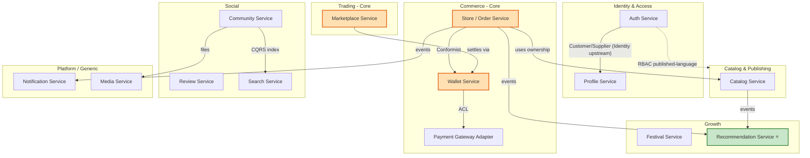

---

## 4. کاتالوگ سرویس‌ها

| # | سرویس | نوع | DB | رویدادهای کلیدی (publish) |
|---|-------|-----|-----|---------------------------|
| 1 | **Auth** | Generic | PostgreSQL | `UserRegistered`, `RoleGranted`, `UserBanned` |
| 2 | **Profile** | Supporting | PostgreSQL + Redis | `PresenceChanged` |
| 3 | **Catalog** | Core | PostgreSQL | `GameSubmitted`, `GameApproved`, `GamePublished`, `GamePriceSet`, `OwnershipGranted`, `OwnershipRevoked` |
| 4 | **Store/Order** | **Core** | PostgreSQL | `PurchaseRequested`, `PurchaseCompleted`, `GiftSent`, `RefundRequested` |
| 5 | **Wallet** | **Core** | PostgreSQL | `WalletDebited`, `WalletCredited`, `PaymentFailed`, `GiftCardAbuseDetected` |
| 6 | **Payment Gateway Adapter** | Generic | — (stateless) | `BankPaymentConfirmed` |
| 7 | **Marketplace** | **Core** | PostgreSQL + Redis | `ItemGranted`, `OrderPlaced`, `TradeMatched` |
| 8 | **Review** | Supporting | PostgreSQL | `ReviewPosted`, `ReviewReported` |
| 9 | **Community** | Supporting | PostgreSQL | `PostCreated`, `PostReacted`, `PostReported` |
| 10 | **Search** | Supporting | Elasticsearch | — (consumer) |
| 11 | **Festival** | Supporting | PostgreSQL | `FestivalStarted`, `DiscountApplied` |
| 12 | **Recommendation** | Differentiator | PostgreSQL/Vector | `RecommendationGenerated` |
| 13 | **Notification** | Generic | PostgreSQL | — (consumer) |
| 14 | **Media** | Generic | MinIO (S3) | `MediaUploaded` |

---

## 5. دیاگرام‌های C4

> 📐 **مجموعه‌ی کامل دیاگرام‌ها** (C4 Component برای هر ۱۴ سرویس، همه‌ی Sequence/Flowها، توپولوژی کامل رویدادها و ER دیتامدل هر سرویس) در پیوست اختصاصی آمده است: [diagrams-appendix.md](diagrams-appendix.md). در این بخش سه سطح C4 + دو نمونه‌ی Component کلیدی آورده شده‌اند.

---

### 5.0.1 سطح اول: Context Diagram (نمای محیطی سیستم)
این سطح بالاترین و دورترین نما از سیستم است. در این دیاگرام، کل سیستم شما (پلتفرم Arcadia) به صورت یک جعبه‌ی واحد و بدون هیچ جزئیات فنی در مرکز قرار می‌گیرد. هدف این سطح، نمایش مرزهای سیستم و نحوه تعامل آن با جهان بیرون است.

* **چه چیزهایی در این سطح دیده می‌شود؟**
  - **بازیگران (Actors):** کاربر عادی، توسعه‌دهنده بازی (Developer)، پشتیبان سامانه (Support) و مدیر (Admin).
  - **سیستم‌های بیرونی (External Systems):** درگاه پرداخت بانکی (PSP) یا سرویس‌های شخص ثالث.
  - ارتباطات کلی (مثلاً: کاربر از سیستم بازی می‌خرد / سیستم با بانک تراکنش انجام می‌دهد).

---

### 5.0.2 سطح دوم: Container Diagram (نمای کانتینرها و سرویس‌ها)
با زوم کردن روی جعبه‌ی سطح اول، به سطح دوم می‌رسیم. در مدل C4، منظور از **Container** هر لایه یا سرویس مستقلی است که کد سناریوی خود را اجرا می‌کند و دیتابیس یا هاست مجزا دارد (مانند یک میکروسرویس، یک اپلیکیشن فرانت‌اند یا یک دیتابیس). این سطح، توپولوژی کلان فنی سیستم را نشان می‌دهد.

* **چه چیزهایی در این سطح دیده می‌شود؟**
  - اپلیکیشن فرانت‌اند (Next.js Web App).
  - درگاه ورود سیستم (API Gateway).
  - تک‌تک **۱۴ میکروسرویس** دامنه‌ای و زیرساختی (Auth, Catalog, Wallet, Store, Marketplace و...).
  - دیتابیس‌های مجزا (PostgreSQL, Redis, Elasticsearch).
  - واسط پیام‌رسانی توزیع‌شده (Apache Kafka).
  - نحوه ارتباط کانتینرها با هم (مانند پروتکل HTTP/REST یا پیام‌های Async کافکا).

---

### 5.0.3 سطح سوم: Component Diagram (نمای اجزای داخلی یک سرویس)
با زوم کردن روی یکی از کانتینرها/میکروسرویس‌های سطح دوم، به سطح سوم می‌رسیم. این سطح، معماری داخلی و نحوه چیدمان کدهای درون **یک میکروسرویس مشخص** را تجزیه و تحلیل می‌کند. طبق مستند شما، در این بخش برای نمونه، معماری داخلی دو سرویس حیاتی `Store` و `Marketplace` شکافته شده است.

* **چه چیزهایی در این سطح دیده می‌شود؟**
  - لایه‌های ساختاری کدهای داخلی بر اساس **معماری پاک (Clean Architecture)**.
  - کنترلرها و پورت‌های ورودی (Inbound Ports / Controllers).
  - اجزای منطق تجاری سیستم (Domain Use Cases / Entities).
  - پورت‌ها و آداپتورهای خروجی (Outbound Ports / Adapters برای اتصال به دیتابیس یا کافکا).
  - اجزای داخلی موتور تطبیق (Matching Engine) در سرویس مارکت‌پلیس یا ارکستراتور ساگا (Saga Orchestrator) در سرویس استور.

---

> **خلاصه مفاهیم:**
> - **سطح ۱ (Context):** سیستم من از بیرون با چه کسانی در ارتباط است؟
> - **سطح ۲ (Container):** سیستم من از چه سرویس‌ها و دیتابیس‌های کلانی تشکیل شده است؟
> - **سطح ۳ (Component):** کدهای داخل هر کدام از این سرویس‌ها با چه ساختار و لایه‌هایی چیده شده‌اند؟

### 5.1 سطح ۱ — System Context

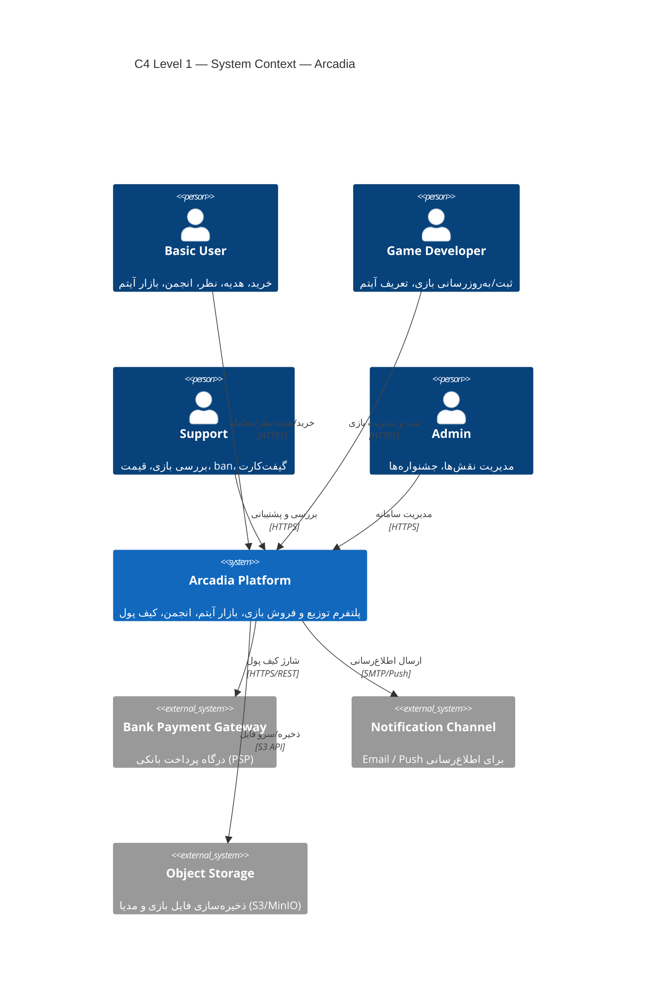

### 5.2 سطح ۲ — Container Diagram

```mermaid
C4Container
    title C4 Level 2 — Container Diagram — Arcadia

    Person(user, "Users", "Basic / Developer / Support / Admin")

    System_Boundary(gh, "Arcadia Platform") {
        Container(web, "Web App", "Next.js", "UI و SSR")
        Container(bff, "BFF / API Gateway", "Spring Cloud Gateway", "روتینگ، JWT، RBAC، rate-limit")

        Container(auth, "Auth Service", "Kotlin/Spring", "احراز هویت، نقش‌ها، ban")
        Container(profile, "Profile Service", "Kotlin/Spring", "پروفایل، presence، inventory read-model")
        Container(catalog, "Catalog Service", "Kotlin/Spring", "بازی، workflow انتشار")
        Container(store, "Store/Order Service", "Kotlin/Spring", "خرید/هدیه/ثبت فروش، Saga، تقسیم درآمد")
        Container(wallet, "Wallet Service", "Kotlin/Spring", "ledger، شارژ، مرجوعی، گیفت‌کارت")
        Container(psp, "Payment Adapter", "Kotlin/Spring", "ACL درگاه بانک")
        Container(market, "Marketplace Service", "Kotlin/Spring", "آیتم، order book، matching engine")
        Container(review, "Review Service", "Kotlin/Spring", "نظرات Like/Dislike، report، sort")
        Container(community, "Community Service", "Kotlin/Spring", "انجمن per-game، پست، کامنت، فید+sort")
        Container(search, "Search Service", "Kotlin/Spring", "ایندکس/جستجو (CQRS)")
        Container(festival, "Festival Service", "Kotlin/Spring", "جشنواره، تخفیف")
        Container(reco, "Recommendation Service", "Kotlin/Spring", "موتور پیشنهاد")
        Container(notif, "Notification Service", "Kotlin/Spring", "اطلاع‌رسانی")
        Container(media, "Media Service", "Kotlin/Spring", "آپلود/سرو فایل")

        ContainerQueue(kafka, "Event Backbone", "Apache Kafka", "رویدادها + Outbox + DLQ")
        ContainerDb(pg, "PostgreSQL", "PostgreSQL", "هر سرویس instance مجزای خود را دارد (Database-per-Service)")
        ContainerDb(redis, "Redis", "Redis", "کش، presence، distributed lock، rate-limit")
        ContainerDb(es, "Elasticsearch", "Elasticsearch", "ایندکس جستجوی انجمن")
        ContainerDb(minio, "Object Storage", "MinIO/S3", "فایل بازی و مدیا")
    }

    System_Ext(bank, "Bank Gateway", "PSP")

    %% ورودی کاربر (sync)
    Rel(user, web, "استفاده", "HTTPS")
    Rel(web, bff, "API", "HTTPS/JSON")
    Rel(bff, auth, "REST + JWT")
    Rel(bff, catalog, "REST + JWT")
    Rel(bff, store, "REST + JWT")
    Rel(bff, market, "REST + JWT")
    Rel(bff, community, "REST + JWT")
    Rel(bff, search, "REST + JWT")

    %% backbone رویداد (async)
    Rel(store, kafka, "pub/sub")
    Rel(wallet, kafka, "pub/sub")
    Rel(catalog, kafka, "pub/sub")
    Rel(market, kafka, "pub/sub")
    Rel(reco, kafka, "consume")
    Rel(notif, kafka, "consume")
    Rel(search, kafka, "consume")

    %% داده‌ها (نمونه‌ی نمایندهٔ Database-per-Service)
    Rel(store, pg, "owns DB")
    Rel(wallet, pg, "owns DB")
    Rel(catalog, pg, "owns DB")
    Rel(market, pg, "owns DB")
    Rel(profile, redis, "presence/cache")
    Rel(search, es, "index/query")
    Rel(media, minio, "store", "S3 API")

    %% بیرونی و فایل
    Rel(community, media, "upload", "REST")
    Rel(wallet, psp, "charge", "REST/ACL")
    Rel(psp, bank, "pay", "HTTPS")

    UpdateLayoutConfig($c4ShapeInRow="4", $c4BoundaryInRow="1")
```

### 5.3 سطح ۳ — Component Diagram: Store / Order Service (Saga orchestrator)

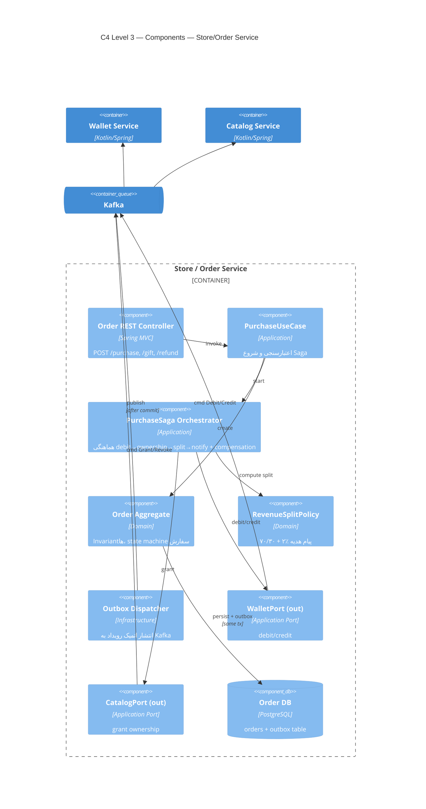

### 5.4 سطح ۳ — Component Diagram: Marketplace (Matching Engine)

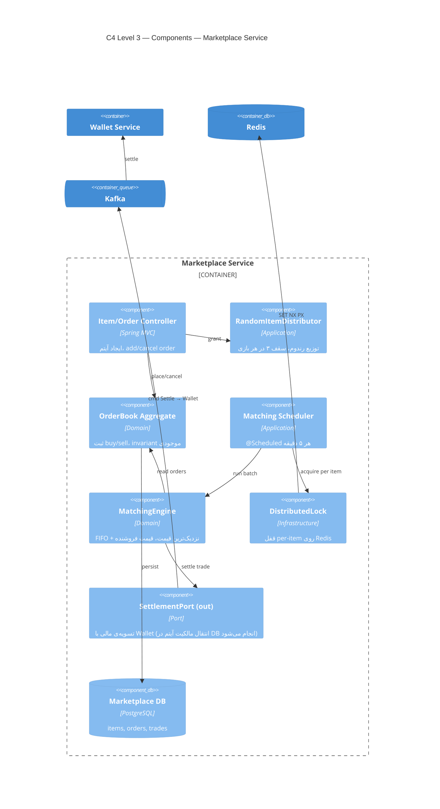

---

## 6. Sequence Diagrams (Sagaهای کلیدی)

### 6.1 Saga خرید/هدیه‌ی بازی (Orchestration + Compensation)

> الگو: **Orchestration Saga**. سرویس Store هماهنگ‌کننده است؛ به هر سرویس **command** می‌فرستد (روی Kafka) و منتظر **reply event** می‌ماند. همه‌ی گام‌ها idempotent و دارای مسیر جبران (compensation) هستند.

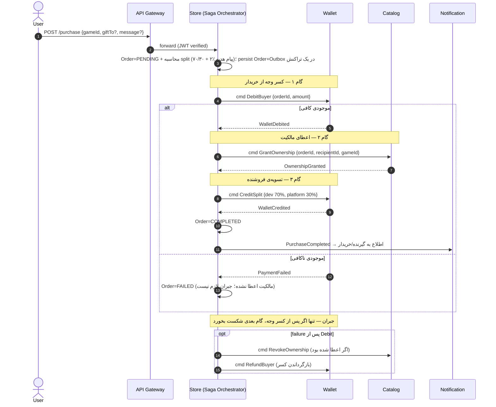

### 6.2 مرجوعی (Refund ≤ 12h)

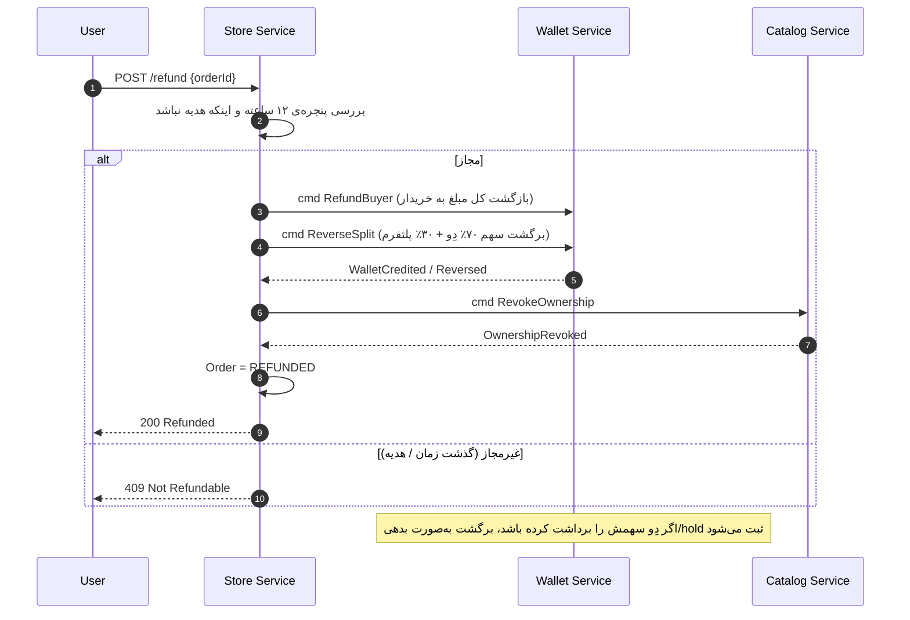

### 6.3 Matching Engine (هر ۵ دقیقه)

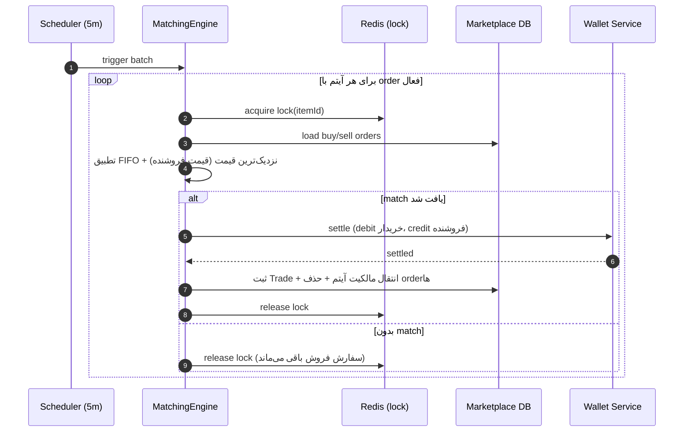

### 6.4 Workflow انتشار بازی (state machine)

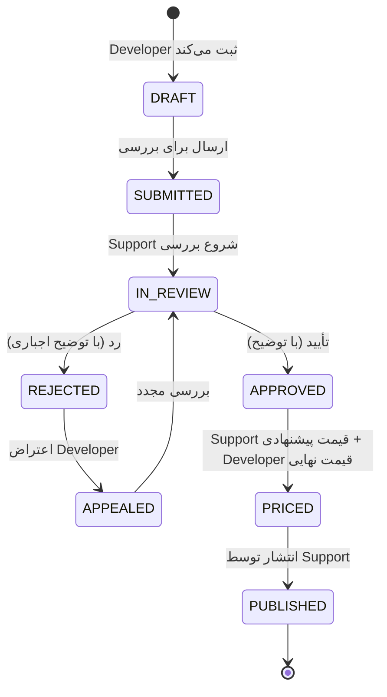

---

## 7. معماری داده و رویداد
### 7.1 الگوی دیتابیس مجزا و چندگانگی ذخیره‌سازی (Database-per-Service & Polyglot Persistence)

در معماری Arcadia، هیچ‌گونه پایگاه داده مرکزی وجود ندارد. در عوض از دو الگوی کلیدی زیر برای مدیریت داده‌ها استفاده شده است:

* **دیتابیس مجزا برای هر سرویس (Database-per-Service):** هر یک از ۱۴ میکروسرویس دارای Schema و پایگاه داده کاملاً مستقل خود هستند. هیچ سرویسی تحت هیچ شرایطی اجازه دسترسی مستقیم (برقراری Connection یا اجرای Query) به دیتابیس سرویس دیگر را ندارد. ارتباطات صرفاً از طریق فراخوانی لایه آداپتور (REST API) یا مصرف رویدادها (Event-Driven) انجام می‌شود. این کار وابستگی داده‌ای (Data Coupling) را به صفر می‌رساند.
* **چندگانگی ذخیره‌سازی (Polyglot Persistence):** به جای استفاده از یک نوع دیتابیس برای همه کارها، تکنولوژی پایگاه داده بر اساس جنس و نیازِ Use Case هر سرویس انتخاب شده است:
  * **PostgreSQL (دیتابیس رابطه‌ای / SQL):** برای نگهداری داده‌های ساختاریافته، حساس و تراکنشی (Transactional) مانند اطلاعات کاربری، سبد خرید، وضعیت کیف پول و لجر مالی که به بستر پایدار و پشتیبانی از قوانین ACID نیاز دارند.
  * **Redis (پایگاه داده درون‌حافظه‌ای / In-Memory):** به دلیل سرعت فوق‌العاده بالا، برای مدیریت وضعیت آنلاین/آفلاین کاربران (Presence)، کش کردن داده‌های پرمصرف، مدیریت قفل‌های توزیع‌شده (Distributed Locks) جهت جلوگیری از Race Condition در بازار آیتم‌ها، و اعمال محدودیت ترافیکی (Rate-Limiting).
  * **Elasticsearch (موتور جستجوی متنی):** برای لایه خوانشِ سرویس جستجو (Search Service) جهت اجرای کوئری‌های متنی پیشرفته، فازی و Exact-match روی پست‌ها و کاتالوگ بازی‌ها با سرعت بالا.
  * **MinIO (ذخیره‌سازی شیء / Object Storage سازگار با S3):** برای ذخیره و مدیریت فایل‌های سنگین غیرساختاریافته مانند تصاویر پروفایل، تیزر بازی‌ها و فایل‌های چندرسانه‌ای در سرویس رسانه (Media Service).

---

### 7.2 Transactional Outbox (تضمین atomicity)
یکی از چالش‌های بزرگ میکروسرویس‌ها این است که وقتی تغییر حالتی در دیتابیس رخ می‌دهد (مثلاً موجودی کیف پول کم می‌شود)، چطور همزمان یک پیام به کافکا ارسال کنیم که ۱۰۰٪ مطمئن باشیم هر دو کار با هم موفق یا با هم شکست می‌خورند (Atomicity). اگر دیتابیس آپدیت شود اما کافکا قطع باشد، سیستم دچار ناسازگاری شدید می‌شود.

برای حل این چالش از الگوی **Transactional Outbox** استفاده شده است:

* **مکانیزم تراکنش واحد (Same TX):** زمانی که یک Use Case (مثلاً خرید بازی) اجرا می‌شود، برنامه همزمان دو کار را درون **یک تراکنش واحد دیتابیس (Same Transaction)** انجام می‌دهد:
  1. وضعیت جدید را در جدول اصلی سرویس (مثلاً جدول `orders`) ذخیره می‌کند.
  2. خبرِ وقوع این رویداد را در یک جدول کمکی به نام **Outbox Table** درج می‌کند.
  به لطف خاصیت ACID دیتابیس‌های رابطه‌ای، یا هر دو جدول با هم ذخیره می‌شوند یا کل عملیات لغو (Rollback) می‌شود.
* **ارسال‌کننده اوت‌باکس (Outbox Dispatcher):** یک کامپوننت یا پردازش مجزا (که می‌تواند یک Worker داخلی با متد Poll یا ابزارهای CDC مثل Debezium باشد) مداوم جدول Outbox را بررسی می‌کند. این ابزار رویدادهای خام را برمی‌دارد و روی **صف پیام کافکا (Kafka)** منتشر (Publish) می‌کند. پس از اطمینان از ارسال موفق به کافکا، پیام را از جدول اوت‌باکس پاک یا وضعیت آن را تغییر می‌دهد.
* **تضمین حداقل یک‌بار ارسال (At-Least-Once Delivery):** این الگوریتم تضمین می‌کند که هیچ پیامی هرگز گم نخواهد شد. اما به دلیل احتمال قطعی شبکه در زمان تاییدیه کافکا، ممکن است یک پیام دوبار به کافکا ارسال شود.
* **مصرف‌کنندگان هم‌پتانسیل (Idempotent Consumers):** برای اینکه ارسال مجدد پیام‌ها سیستم را به هم نریزد، تمام میکروسرویس‌هایی که پیام‌های کافکا را مصرف می‌کنند، به صورت **Idempotent** طراحی شده‌اند؛ یعنی با چک کردن یک شناسه منحصربه‌فرد (`Event ID`) در دیتابیس خود، تکراری بودن پیام را تشخیص داده و یک پیام را دوبار پردازش نمی‌کنند.


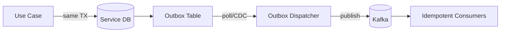

### 7.3 CQRS
در بخش‌های پرخوانش سیستم (مانند صفحه اصلی، جستجو و پروفایل)، اگر بخواهیم مدام داده‌ها را با Joinهای سنگین توزیع‌شده از چندین میکروسرویس بگیریم، سیستم قفل می‌کند. الگو **CQRS** لایه نوشتن (تغییر داده) را کاملاً از لایه خواندن (پرس‌وجو) جدا می‌کند:

* **بخش نوشتن (Write Side):** سرویس‌های اصلی سیستم و Aggregateهای دامنه (مانند کاتالوگ بازی‌ها، فروشگاه، کیف پول و مارکت‌پلیس) لایه Write را تشکیل می‌دهند. وظیفه این بخش اعتبارسنجی قوانین تجاری و ذخیره اطلاعات خام تراکنشی در پایگاه داده عملیاتی (PostgreSQL) است. این بخش روی صحت داده‌ها تمرکز دارد.
* **بخش خواندن (Read Side):** این بخش مدل‌های بهینه‌شده‌ای برای خواندن سریع داده‌ها (Projectionها یا Read-Models) در ابزارهای مخصوص ایجاد می‌کند. این مدل‌ها به طور مداوم با گوش دادن و مصرف رویدادهای کافکا (Consume) که از سمت Write صادر شده‌اند، به طور ناهمگام (Async) و با اصل یکپارچگی نهایی (Eventual Consistency) به‌روزرسانی می‌شوند:
  * **Search:** اطلاعات بازی‌ها و پست‌ها را در Elasticsearch آماده نگه‌می‌دارد تا جستجوی آنی انجام شود.
  * **Profile:** یک کپی بهینه‌شده از لیست مالکیت بازی‌های کاربر، دارایی آیتم‌ها و ۵ پست برتر او را در یک Schema آماده خواندن نگه می‌دارد تا لود صفحه پروفایل کاربر زیر ۳۰۰ میلی‌ثانیه باشد.
  * **Recommendation:** داده‌های رفتاری را برای موتور پیشنهاددهی به شکل بهینه فرمت‌دهی می‌کند.


### 7.4 Event Catalog (نمونه)
| Topic | Producer | Consumers |
|-------|----------|-----------|
| `user-events` | Auth | Profile, Notification, Reco |
| `game-events` | Catalog | Search, Reco, Festival, Profile, Wallet (credit), Review (buyer-proj) |
| `purchase-events` | Store | Wallet, Notification, Reco |
| `wallet-events` | Wallet | Store (saga), Catalog (grant), Auth (abuse), Notification |
| `trade-events` | Marketplace | Wallet, Profile (inventory read-model), Notification |
| `community-events` | Community | Search, Profile (top posts) |
| `review-events` | Review | Profile, Reco, Notification |

> نکته: `OwnershipGranted`/`OwnershipRevoked` متعلق به Catalog است (مالکیت در Catalog نگه‌داری می‌شود) و روی `game-events` منتشر می‌شود؛ Wallet آن را برای واریز سهم و Profile/Review برای read-model مصرف می‌کنند.

---

## 8. Cross-Cutting Concerns

این بخش به قابلیت‌هایی می‌پردازد که در تمامی میکروسرویس‌ها جریان داشته و تضمین‌کننده‌ی امنیت، پایداری و قابلیت رصدِ کل پلتفرم هستند.

### 8.1 امنیت (Security)
امنیت سامانه در لایه‌های زیر پیاده‌سازی شده است:
- **احراز هویت (Authentication):** استفاده از توکن‌های **JWT** (با عمر کوتاه برای Access و عمر بلند برای Refresh). اعتبارسنجی این توکن‌ها در دروازه ورودی (API Gateway) و تمامی میکروسرویس‌ها به صورت متمرکز انجام می‌شود.
- **کنترل دسترسی (RBAC):** سطوح دسترسی بر اساس «نقش» کاربران مدیریت می‌شود. همچنین در سرویس‌های حساس، امنیت در لایه متد (Method-level Security) اعمال شده تا از دسترسی‌های غیرمجاز جلوگیری شود.
- **امنیت تراکنش‌های مالی:** استفاده از **لجر تغییرناپذیر (Append-only)** برای ثبت وقایع، اعمال **Idempotency-Key** بر روی تمامی تراکنش‌های مالی جهت جلوگیری از عملیات تکراری، و بهره‌گیری از مکانیزم **Saga Compensation** برای بازگرداندن وضعیت مالی در صورت بروز خطا.
- **محافظت در برابر سوءاستفاده (Abuse Protection):** اعمال محدودیت نرخ درخواست (Rate-Limit) در Gateway و استفاده از الگوی **Sliding-window** در Redis برای شناسایی و بلاک کردن خودکار الگوهای مشکوک (مثلاً وارد کردن کدهای گیفت‌کارت اشتباه).
- **مدیریت محرمانگی:** تمامی داده‌های حساس و کلیدهای رمزنگاری در سرویس‌های مدیریت امن مانند **Kubernetes Secret** یا **Vault** نگهداری شده و هرگز در کد منبع قرار نمی‌گیرند.

### 8.2 Observability & Operability

برای دستیابی به شفافیت کامل در عملکرد سیستم، از استاندارد سه ستون (**Logs / Metrics / Traces**) **OpenTelemetry** استفاده شده است. تمامی سرویس‌ها داده‌های خود را به یک **OTel Collector** مرکزی ارسال می‌کنند که وظیفه‌ی جمع‌آوری، پردازش و ارسال آن‌ها به Backendهای تخصصی را دارد. این جداسازی باعث می‌شود که بدون تغییر در کدِ میکروسرویس‌ها، بتوان Backendهای ذخیره‌سازی را ارتقا داد (Maintainability).

#### معماری Observability

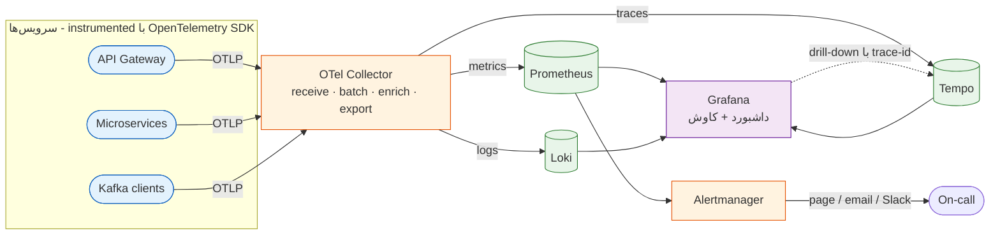
#### لاگ‌گیری (Logs)
- **ساختار:** تمامی لاگ‌ها به صورت **Structured JSON** و با فیلدهای استاندارد (مثل `traceId` برای ردگیری و `correlationId` برای پیوستگی در جریان‌های توزیع‌شده) ثبت می‌شوند.
- **تداوم:** لاگ‌های عمومی در **Loki** برای بررسی‌های کوتاه‌مدت تجمیع می‌شوند، در حالی که لاگ‌های حساسِ مالی برای ممیزی‌های بلندمدت به صورت جداگانه ذخیره می‌گردند.

#### متریک‌ها (Metrics)
- **پایش:** با استفاده از **Micrometer**، داده‌ها به **Prometheus** ارسال می‌شوند. این متریک‌ها شامل سه دسته‌ی کلیدی هستند:
  - **RED:** بررسی نرخ (Rate)، خطاها (Errors) و مدت‌زمان پاسخ‌گویی (Duration).
  - **USE:** بررسی میزان استفاده از منابع سرور.
  - **متریک‌های دامنه‌ای:** تحلیل کسب‌وکار، مثل نرخ تطبیق سفارشات در مارکت‌پلیس یا تاخیر در پردازشِ رویدادهای کافکا.

#### ردیابی توزیع‌شده (Traces)
- **OpenTelemetry + Tempo:** با پیاده‌سازی این سیستم، می‌توان مسیر دقیقِ یک درخواست را از زمان ورود به Gateway تا رسیدن به دیتابیس در هر میکروسرویس دنبال کرد. این امر برای دیباگ تراکنش‌های پیچیده‌ی مالی در معماری Saga حیاتی است.

#### پایشِ SLO / SLI و هشداردهی (Alerting)
در جدول زیر، شاخص‌های کلیدی عملکرد (SLI) و اهداف کیفی (SLO) تعریف شده‌اند:

#### SLO / SLI و Alerting

| سرویس/جریان | SLI | SLO هدف | Alert |
|--------------|-----|---------|-------|
| API Gateway | p95 latency خواندن | < 300ms | p95 > 500ms به‌مدت ۵m |
| Store/Wallet (مالی) | نرخ موفقیت Saga | ≥ 99.9% | هر Saga در حالت `COMPENSATING` گیرکرده |
| Wallet | اختلاف ledger (debit=credit) | = 0 | هر اختلاف ≠ 0 → page فوری |
| Kafka consumers | consumer lag | < 1000 پیام | lag صعودی پایدار |
| Matching Engine | اتمام در پنجره | < 5m | عبور از پنجره‌ی بعدی |
| همه | error rate | < 0.1% | جهش > 1% |
| همه | DLQ depth | ≈ 0 | هر پیام در DLQ |

- **Alertmanager** با routing بر اساس severity؛ alertهای مالی (`Wallet ledger mismatch`, `Saga stuck`, `DLQ`) **P1/page** هستند.

#### Financial Audit Log (الزام پروژه)

تراکنش‌های مالی علاوه بر ledger درون‌سرویسی، در یک **مسیر audit تغییرناپذیر (append-only / WORM)** هم ثبت می‌شوند تا قابلیت گزارش‌گیری و عدم انکار (non-repudiation) داشته باشیم.

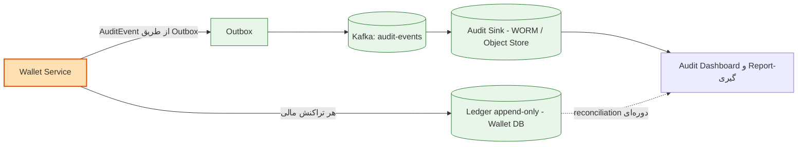
- **اصل حقیقت:** منبع اصلی اطلاعات، Ledger دیتابیس است؛ اما مسیر Audit به عنوان یک کپیِ immutable برای بازرسی استفاده می‌شود. مکانیزم **Reconciliation** دوره‌ای، هرگونه مغایرت بین این دو منبع را شناسایی و بلافاصله هشدار (Alert) صادر می‌کند.

---

## 9. دیاگرام استقرار (Kubernetes)

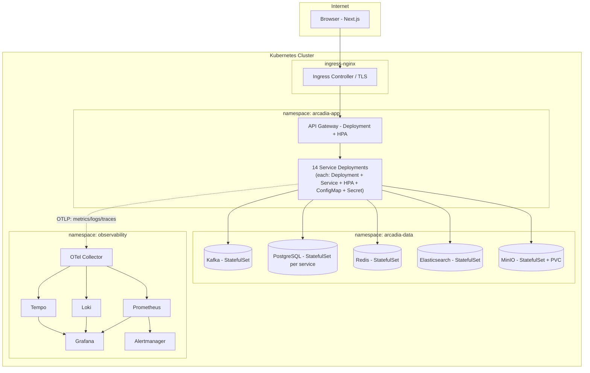

**نکات استقرار:** سرویس‌های اپ **stateless** و قابل HPA؛ زیرساخت‌های stateful با StatefulSet + PVC؛ جداسازی namespace؛ readiness/liveness probe؛ ConfigMap/Secret برای پیکربندی؛ NetworkPolicy برای محدودسازی ترافیک شرق-غرب.

---

## 10. CI/CD

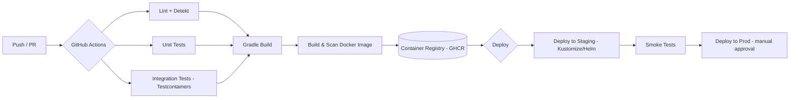

- هر سرویس **pipeline مستقل** (monorepo با path-filter یا multi-repo).
- **Testcontainers** برای تست یکپارچه با Postgres/Kafka واقعی.
- **Trivy/Scan** برای امنیت image؛ **SBOM**.
- استقرار با **Helm chart** یا **Kustomize overlay** (staging/prod)؛ rollback خودکار در شکست probe.
- pipeline جدا برای **Next.js** (build + e2e + deploy).

---

## 11. نگاشت Quality Attribute

| Quality Attribute | تاکتیک معماری | محل پیاده‌سازی |
|-------------------|----------------|----------------|
| **Reliability (مالی)** | Outbox + Saga + idempotency + DLQ + append-only ledger | Store, Wallet |
| **Consistency تقسیم درآمد** | RevenueSplitPolicy در Domain + Saga atomic | Store |
| **Scalability** | Stateless + HPA + Kafka partition + Redis cache | همه |
| **Performance** | CQRS read-model + cache + batch matching | Search, Profile, Marketplace |
| **Availability** | Bulkhead + Circuit Breaker + graceful degradation | Gateway, Reco, Search |
| **Security** | JWT + RBAC + rate-limit + abuse detection | Auth, Gateway, Wallet |
| **Maintainability** | Bounded context + Clean Arch + contract versioning + central log | همه |
| **Observability** | OpenTelemetry (logs/metrics/traces) + OTel Collector + Prometheus/Loki/Tempo + Alertmanager + correlation-id | همه |
| **Auditability (مالی)** | append-only ledger + audit sink تغییرناپذیر + reconciliation | Wallet |
| **Compatibility** | Anti-Corruption Layer | Payment Adapter |
| **Real-time presence** | WebSocket/heartbeat + Redis TTL | Profile |

---

## 12. User Stories

نمونه یوزراستوری‌‌های ما در زیر آورده شده است:
- **US-1 (Basic User):** به‌عنوان کاربر، می‌خواهم بازی را برای دوستم هدیه بخرم با پیام، تا غافلگیرش کنم. *(AC: ۲٪ هزینه‌ی پیام، گیرنده مالکیت می‌گیرد، غیرقابل‌مرجوع.)*
- **US-2 (Developer):** به‌عنوان توسعه‌دهنده، می‌خواهم بازی ثبت و قیمت نهایی را تعیین کنم، تا منتشر شود. *(AC: بررسی Support، قیمت پیشنهادی فقط راهنما.)*
- **US-3 (Support):** به‌عنوان پشتیبان، می‌خواهم بازی را با توضیح رد کنم، تا Developer بتواند اعتراض کند.
- **US-4 (Basic User):** به‌عنوان کاربر، می‌خواهم سفارش فروش آیتم ثبت کنم، تا در تطبیق ۵ دقیقه‌ای فروخته شود.
- **US-5 (Basic User):** به‌عنوان کاربر، می‌خواهم بازی‌ای را از کتابخانه‌ی عمومی‌ام مخفی کنم، تا دیگران نبینند.
- **US-6 (Admin):** به‌عنوان مدیر، می‌خواهم جشنواره با تخفیف بسازم و کاربران را notify کنم.

---

## 13. Architecture Decision Records (ADR)

| ADR | تصمیم | دلیل | Trade-off |
|-----|-------|------|-----------|
| **ADR-1** | Microservices ریزدانه (۱۴ سرویس) | ایزولاسیون، مقیاس‌پذیری مستقل، نمره‌ی معماری | پیچیدگی عملیاتی بالاتر |
| **ADR-2** | Event-driven با Kafka | decoupling، reliability، scalability | eventual consistency |
| **ADR-3** | Transactional Outbox | atomicity بین DB و event | overhead جدول/dispatcher |
| **ADR-4** | Saga (orchestration برای مالی) | کنترل صریح + compensation | پیچیدگی کد saga |
| **ADR-5** | Auth دست‌ساز (Spring Security + JWT) | کنترل کامل RBAC | مسئولیت امنیتی بیشتر نسبت به Keycloak |
| **ADR-6** | Database-per-Service | استقلال و decoupling داده | join توزیع‌شده ندارد |
| **ADR-7** | CQRS فقط در نقاط پرخوانش | تعادل سادگی/کارایی | همگام‌سازی projection |

---

## 14. ریسک‌ها و Trade-offها

- **پیچیدگی عملیاتی ۱۴ سرویس:** با Helm/Kustomize، قالب مشترک سرویس (service template)، و observability یکپارچه مهار می‌شود.
- **Eventual consistency:** برای داده‌ی مالی با Saga + idempotency کنترل می‌شود؛ کاربر در UI «در حال پردازش» می‌بیند.
- **محدودیت سخت‌افزار دمو:** امکان اجرای زیرمجموعه‌ای از سرویس‌ها با Docker Compose برای توسعه‌ی محلی؛ K8s برای استقرار کامل.
- **Matching concurrency:** قفل توزیع‌شده per-item از race جلوگیری می‌کند؛ batch بودن بار را کنترل می‌کند.

---

## 15. خلاصه معماری پلتفرم Arcadia

Arcadia یک سیستم میکروسرویسیِ مدرن است که با هدف ارائه‌ی تجربه‌ای مشابه Steam، همراه با بازاری پیشرفته برای آیتم‌های درون‌بازی و شبکه‌ی اجتماعی طراحی شده است. این سیستم بر پایه‌ی اصول **DDD** و **Clean Architecture** بنا شده و اولویت آن پایداری مالی، مقیاس‌پذیری بالا و قابلیت رصد لحظه‌ای است.

---

### 15.1 استراتژی و سبک معماری
* **معماری کلان:** سیستم از **۱۴ میکروسرویس** مستقل تشکیل شده که از طریق **Apache Kafka** به صورت ناهمگام (Async) با هم در ارتباط‌اند.
* **یکپارچگی داده‌ها:** بهره‌گیری از الگوی **Database-per-Service** برای ایزولاسیون کامل دامنه‌ها و استفاده از **Transactional Outbox** جهت تضمین اتمی بودن عملیات دیتابیس و رویدادهای پیام‌رسان.
* **مدیریت تراکنش‌های توزیع‌شده:** پیاده‌سازی الگوی **Saga (Orchestration)** برای عملیات‌های حساس مالی و تضمین وضعیت `Exactly-Once`.
* **بهینه‌سازی کارایی:** استفاده از **CQRS** برای جدا کردن لایه‌ی نوشتن از خواندن در سرویس‌های پرترافیک مانند جستجو و پروفایل.

### 15.2 ویژگی‌های کلیدی دامنه‌ها
* **تجارت و مالی (Commerce/Wallet):** دارای لجر (Ledger) تغییرناپذیر، مکانیزم تقسیم درآمد ۷۰/۳۰ برای توسعه‌دهندگان و سیستم بازگشت وجه (Refund) هوشمند.
* **بازار آیتم‌ها (Marketplace):** مجهز به **Matching Engine** اختصاصی که هر ۵ دقیقه سفارشات خرید و فروش را با اولویت‌بندی قیمت تطبیق می‌دهد.
* **امنیت و حفاظت:** اجرای دقیق **RBAC** برای کنترل دسترسی‌ها، استفاده از **Sliding-window** برای جلوگیری از سوءاستفاده‌های گیفت‌کارت و پیاده‌سازی **Anti-Corruption Layer (ACL)** برای درگاه‌های پرداخت بیرونی.

</div>