

# Arcadia — پیوست کامل دیاگرام‌ها

> مکمل [Arcadia-Architecture.md](Arcadia-Architecture.md) (بخش ۵) — مجموعه‌ی کامل دیاگرام‌ها.
> همه با **Mermaid**. شامل: C4 Component برای هر ۱۴ سرویس · همه‌ی Sequence/Flowها · توپولوژی رویدادها · ER دیتامدل هر سرویس.

## فهرست

### الف) C4 Level 3 — Component (هر ۱۴ سرویس)
- [الف) C4 Level 3 — Component (هر ۱۴ سرویس)](#الف-c4-level-3--component-هر-۱۴-سرویس)
  - [الف-۱) Auth Service](#الف-۱-auth-service)
  - [الف-۲) Profile Service](#الف-۲-profile-service)
  - [الف-۳) Catalog Service](#الف-۳-catalog-service)
  - [الف-۴) Store / Order Service](#الف-۴-store--order-service)
  - [الف-۵) Wallet Service](#الف-۵-wallet-service)
  - [الف-۶) Payment Gateway Adapter](#الف-۶-payment-gateway-adapter)
  - [الف-۷) Marketplace Service](#الف-۷-marketplace-service)
  - [الف-۸) Review Service](#الف-۸-review-service)
  - [الف-۹) Community Service](#الف-۹-community-service)
  - [الف-۱۰) Search Service (CQRS read side)](#الف-۱۰-search-service-cqrs-read-side)
  - [الف-۱۱) Festival Service](#الف-۱۱-festival-service)
  - [الف-۱۲) Recommendation Service](#الف-۱۲-recommendation-service)
  - [الف-۱۳) Notification Service](#الف-۱۳-notification-service)
  - [الف-۱۴) Media Service](#الف-۱۴-media-service)

### ب) Sequence / Flow Diagrams
- [ب) Sequence / Flow Diagrams](#ب-sequence--flow-diagrams)
  - [ب-۱) ثبت‌نام + تأیید Support](#ب-۱-ثبت‌نام--تأیید-support)
  - [ب-۲) درخواست نقش Developer/Support + تأیید/رد](#ب-۲-درخواست-نقش-developersupport--تأییدرد)
  - [ب-۳) شارژ کیف پول از درگاه بانکی](#ب-۳-شارژ-کیف-پول-از-درگاه-بانکی)
  - [ب-۴) استفاده از گیفت‌کارت + تشخیص abuse و ban](#ب-۴-استفاده-از-گیفت‌کارت--تشخیص-abuse-و-ban)
  - [ب-۵) چرخه‌ی کامل انتشار بازی (Sequence)](#ب-۵-چرخه‌ی-کامل-انتشار-بازی-sequence)
  - [ب-۶) ثبت نظر با بررسی خریدار بودن](#ب-۶-ثبت-نظر-با-بررسی-خریدار-بودن)
  - [ب-۷) ایجاد پست + آپلود مدیا + ایندکس جستجو (Choreography)](#ب-۷-ایجاد-پست--آپلود-مدیا--ایندکس-جستجو-choreography)
  - [ب-۸) ایجاد جشنواره + تخفیف + اطلاع به Developerها](#ب-۸-ایجاد-جشنواره--تخفیف--اطلاع-به-developerها)
  - [ب-۹) تولید و سرو پیشنهاد (Recommendation)](#ب-۹-تولید-و-سرو-پیشنهاد-recommendation)
  - [ب-۱۰) به‌روزرسانی وضعیت آنلاین (Presence — real-time)](#ب-۱۰-به‌روزرسانی-وضعیت-آنلاین-presence--real-time)
  - [ب-۱۱) توزیع رندوم آیتم (سقف ۳ در هر بازی)](#ب-۱۱-توزیع-رندوم-آیتم-سقف-۳-در-هر-بازی)

### ج) توپولوژی رویدادها (Event Choreography)
- [ج) توپولوژی رویدادها (Event Choreography)](#ج-توپولوژی-رویدادها-event-choreography)
  - [ج-۱) جریان رویدادهای مالی (Saga محور)](#ج-۱-جریان-رویدادهای-مالی-saga-محور)
  - [ج-۲) جریان رویدادهای محتوا و رشد (Read-model fan-out)](#ج-۲-جریان-رویدادهای-محتوا-و-رشد-read-model-fan-out)

### د) ER — دیتامدل هر سرویس
- [د) ER — دیتامدل هر سرویس](#د-er--دیتامدل-هر-سرویس)
  - [د-۱) Auth DB](#د-۱-auth-db)
  - [د-۲) Profile DB (read-model / CQRS)](#د-۲-profile-db-read-model--cqrs)
  - [د-۳) Catalog DB](#د-۳-catalog-db)
  - [د-۴) Store / Order DB](#د-۴-store--order-db)
  - [د-۵) Wallet DB](#د-۵-wallet-db)
  - [د-۶) Marketplace DB](#د-۶-marketplace-db)
  - [د-۷) Review DB](#د-۷-review-db)
  - [د-۸) Community DB](#د-۸-community-db)
  - [د-۹) Festival DB](#د-۹-festival-db)
  - [د-۱۰) Notification DB](#د-۱۰-notification-db)
  - [د-۱۱) Media DB](#د-۱۱-media-db)
  - [د-۱۲) Recommendation DB (Vector / read-model)](#د-۱۲-recommendation-db-vector--read-model)
  - [د-۱۳) Search (Elasticsearch — document model)](#د-۱۳-search-elasticsearch--document-model)
  - [د-۱۴) Payment Adapter DB](#د-۱۴-payment-adapter-db)

---

## الف) C4 Level 3 — Component (هر ۱۴ سرویس)
هر یک از ۱۴ میکروسرویس سامانه، برای حفظ جداسازی دغدغه‌ها (Separation of Concerns) و تست‌پذیری، از چهار لایه‌ی استاندارد **Clean Architecture** پیروی می‌کنند:

*   **Presentation:** لایه‌ی آداپتورهای ورودی که درخواست‌های خارجی را از طریق **REST Controllers** یا مصرف‌کننده‌های رویداد (**Kafka Consumers**) دریافت می‌کند.
*   **Application:** قلبِ منطق هماهنگی سیستم؛ شامل **Use Cases**، ارکستراتورهای **Saga** برای تراکنش‌های توزیع‌شده، و پورت‌های (Ports) مورد نیاز برای اتصال به لایه‌های بیرونی.
*   **Domain:** هسته‌ی اصلی کسب‌وکار که بدون وابستگی به هیچ تکنولوژی خارجی، شامل **Aggregates**، قوانین تغییرناپذیر (**Invariants**)، Value Objects و رویدادهای دامنه است.
*   **Infrastructure:** آداپتورهای خروجی که پیاده‌سازیِ فنیِ پورت‌ها را انجام می‌دهند؛ شامل دسترسی به **JPA (PostgreSQL)**، انتشار رویداد (**Kafka Out**)، کار با **Redis** و ذخیره‌سازی فایل در **S3/MinIO**.

> **نکته کلیدی:** در سرویس‌هایی که وظیفه‌ی صدور رویداد (Producer) را بر عهده دارند، کامپوننت **Outbox Dispatcher** در لایه‌ی Infrastructure قرار گرفته است تا تضمین‌کننده انتشار اتمیک پیام‌ها باشد.
### الف-۱) Auth Service

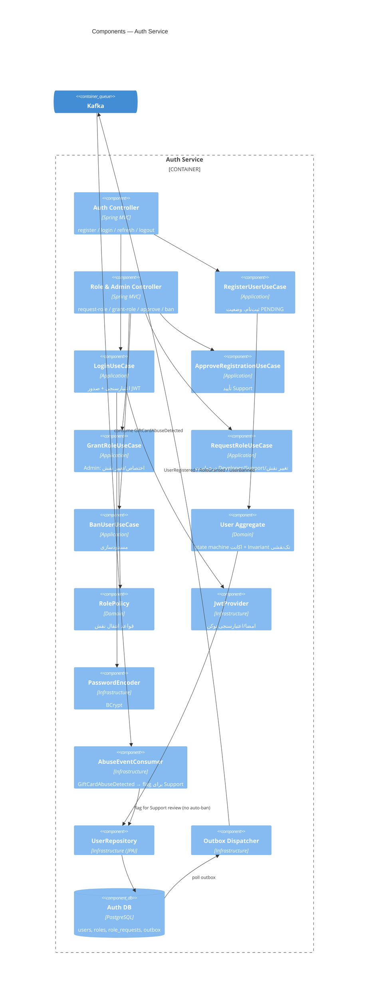
```mermaid
C4Component
    title Components — Auth Service

    Container_Boundary(auth, "Auth Service") {
        Component(authApi, "Auth Controller", "Spring MVC", "register / login / refresh / logout")
        Component(roleApi, "Role & Admin Controller", "Spring MVC", "request-role / grant-role / approve / ban")
        Component(registerUC, "RegisterUserUseCase", "Application", "ثبت‌نام، وضعیت PENDING")
        Component(loginUC, "LoginUseCase", "Application", "اعتبارسنجی + صدور JWT")
        Component(approveUC, "ApproveRegistrationUseCase", "Application", "تأیید Support")
        Component(grantUC, "GrantRoleUseCase", "Application", "Admin: اختصاص/تغییر نقش")
        Component(requestUC, "RequestRoleUseCase", "Application", "درخواست Developer/Support/تغییر نقش")
        Component(banUC, "BanUserUseCase", "Application", "مسدودسازی")
        Component(userAgg, "User Aggregate", "Domain", "state machine اکانت + Invariant تک‌نقشی")
        Component(rolePolicy, "RolePolicy", "Domain", "قواعد انتقال نقش")
        Component(jwt, "JwtProvider", "Infrastructure", "امضا/اعتبارسنجی توکن")
        Component(pwd, "PasswordEncoder", "Infrastructure", "BCrypt")
        Component(abuseCons, "AbuseEventConsumer", "Infrastructure", "GiftCardAbuseDetected → flag برای Support")
        Component(repo, "UserRepository", "Infrastructure (JPA)", "")
        Component(outbox, "Outbox Dispatcher", "Infrastructure", "")
        ComponentDb(db, "Auth DB", "PostgreSQL", "users, roles, role_requests, outbox")
    }
    ContainerQueue(kafka, "Kafka", "", "")

    Rel(authApi, registerUC, "")
    Rel(authApi, loginUC, "")
    Rel(roleApi, approveUC, "")
    Rel(roleApi, grantUC, "")
    Rel(roleApi, requestUC, "")
    Rel(roleApi, banUC, "")
    Rel(registerUC, userAgg, "")
    Rel(grantUC, rolePolicy, "")
    Rel(loginUC, jwt, "")
    Rel(loginUC, pwd, "")
    Rel(userAgg, repo, "")
    Rel(repo, db, "")
    Rel(abuseCons, repo, "flag for Support review (no auto-ban)")
    Rel(kafka, abuseCons, "consume GiftCardAbuseDetected")
    Rel(outbox, kafka, "UserRegistered / RoleGranted / UserBanned")
    Rel(db, outbox, "poll outbox")

    UpdateLayoutConfig($c4ShapeInRow="4")
```

### الف-۲) Profile Service

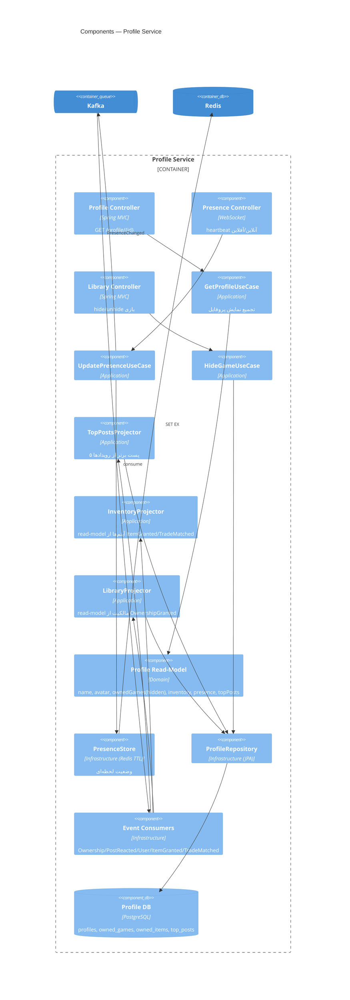
```mermaid
C4Component
    title Components — Profile Service

    Container_Boundary(profile, "Profile Service") {
        Component(profileApi, "Profile Controller", "Spring MVC", "GET /profile/{id}")
        Component(presenceApi, "Presence Controller", "WebSocket", "heartbeat آنلاین/آفلاین")
        Component(libApi, "Library Controller", "Spring MVC", "hide/unhide بازی")
        Component(getUC, "GetProfileUseCase", "Application", "تجمیع نمایش پروفایل")
        Component(presenceUC, "UpdatePresenceUseCase", "Application", "")
        Component(hideUC, "HideGameUseCase", "Application", "")
        Component(topProj, "TopPostsProjector", "Application", "۵ پست برتر از رویدادها")
        Component(invProj, "InventoryProjector", "Application", "read-model آیتم‌ها از ItemGranted/TradeMatched")
        Component(libProj, "LibraryProjector", "Application", "read-model مالکیت از OwnershipGranted")
        Component(profileRM, "Profile Read-Model", "Domain", "name, avatar, ownedGames(hidden), inventory, presence, topPosts")
        Component(presenceStore, "PresenceStore", "Infrastructure (Redis TTL)", "وضعیت لحظه‌ای")
        Component(repo, "ProfileRepository", "Infrastructure (JPA)", "")
        Component(cons, "Event Consumers", "Infrastructure", "Ownership/PostReacted/User/ItemGranted/TradeMatched")
        ComponentDb(db, "Profile DB", "PostgreSQL", "profiles, owned_games, owned_items, top_posts")
    }
    ContainerQueue(kafka, "Kafka", "", "")
    ContainerDb(redis, "Redis", "", "")

    Rel(profileApi, getUC, "")
    Rel(presenceApi, presenceUC, "")
    Rel(libApi, hideUC, "")
    Rel(getUC, profileRM, "")
    Rel(presenceUC, presenceStore, "")
    Rel(presenceStore, redis, "SET EX")
    Rel(hideUC, repo, "")
    Rel(libProj, repo, "")
    Rel(topProj, repo, "")
    Rel(repo, db, "")
    Rel(kafka, cons, "consume")
    Rel(cons, libProj, "")
    Rel(cons, topProj, "")
    Rel(cons, invProj, "")
    Rel(presenceUC, kafka, "PresenceChanged")

    UpdateLayoutConfig($c4ShapeInRow="4")
```

### الف-۳) Catalog Service

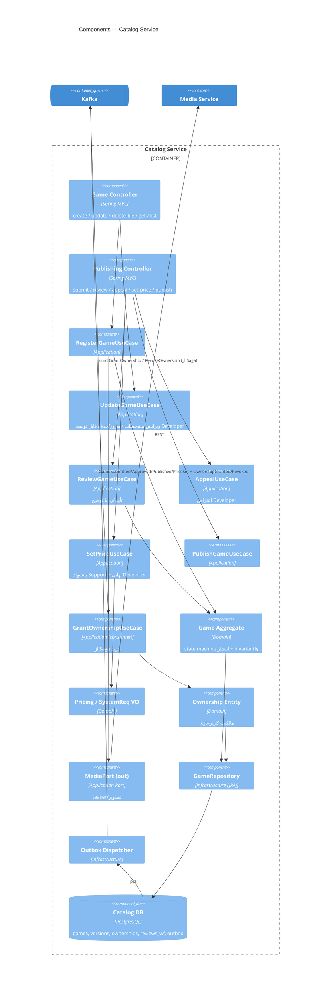
```mermaid
C4Component
    title Components — Catalog Service

    Container_Boundary(catalog, "Catalog Service") {
        Component(gameApi, "Game Controller", "Spring MVC", "create / update / delete-file / get / list")
        Component(wfApi, "Publishing Controller", "Spring MVC", "submit / review / appeal / set-price / publish")
        Component(registerUC, "RegisterGameUseCase", "Application", "")
        Component(updateUC, "UpdateGameUseCase", "Application", "ویرایش مشخصات / به‌روز/حذف فایل توسط Developer")
        Component(reviewUC, "ReviewGameUseCase", "Application", "تأیید/رد با توضیح")
        Component(appealUC, "AppealUseCase", "Application", "اعتراض Developer")
        Component(priceUC, "SetPriceUseCase", "Application", "پیشنهاد Support + نهایی Developer")
        Component(publishUC, "PublishGameUseCase", "Application", "")
        Component(grantUC, "GrantOwnershipUseCase", "Application (consumer)", "از Saga خرید")
        Component(gameAgg, "Game Aggregate", "Domain", "state machine انتشار + Invariantها")
        Component(pricingVO, "Pricing / SystemReq VO", "Domain", "")
        Component(ownership, "Ownership Entity", "Domain", "مالکیت کاربر-بازی")
        Component(mediaPort, "MediaPort (out)", "Application Port", "teaser/تصاویر")
        Component(repo, "GameRepository", "Infrastructure (JPA)", "")
        Component(outbox, "Outbox Dispatcher", "Infrastructure", "")
        ComponentDb(db, "Catalog DB", "PostgreSQL", "games, versions, ownerships, reviews_wf, outbox")
    }
    ContainerQueue(kafka, "Kafka", "", "")
    Container(media, "Media Service", "", "")

    Rel(gameApi, registerUC, "")
    Rel(gameApi, updateUC, "")
    Rel(wfApi, reviewUC, "")
    Rel(wfApi, appealUC, "")
    Rel(wfApi, priceUC, "")
    Rel(wfApi, publishUC, "")
    Rel(registerUC, gameAgg, "")
    Rel(reviewUC, gameAgg, "")
    Rel(priceUC, pricingVO, "")
    Rel(grantUC, ownership, "")
    Rel(gameAgg, repo, "")
    Rel(ownership, repo, "")
    Rel(repo, db, "")
    Rel(registerUC, mediaPort, "")
    Rel(mediaPort, media, "REST")
    Rel(kafka, grantUC, "cmd GrantOwnership / RevokeOwnership (از Saga)")
    Rel(outbox, kafka, "GameSubmitted/Approved/Published/PriceSet + OwnershipGranted/Revoked")
    Rel(db, outbox, "poll")

    UpdateLayoutConfig($c4ShapeInRow="4")
```

### الف-۴) Store / Order Service

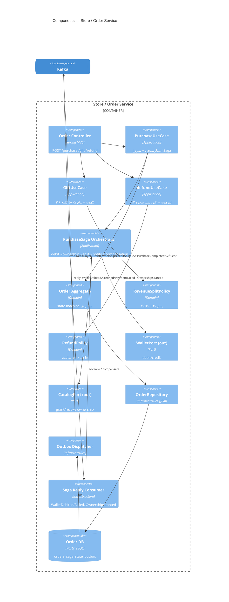
```mermaid
C4Component
    title Components — Store / Order Service

    Container_Boundary(store, "Store / Order Service") {
        Component(orderApi, "Order Controller", "Spring MVC", "POST /purchase /gift /refund")
        Component(purchaseUC, "PurchaseUseCase", "Application", "اعتبارسنجی + شروع Saga")
        Component(giftUC, "GiftUseCase", "Application", "هدیه + پیام ≤۵۰۰ کلمه + ۲٪")
        Component(refundUC, "RefundUseCase", "Application", "بررسی پنجره ۱۲h + غیرهدیه")
        Component(saga, "PurchaseSaga Orchestrator", "Application", "debit→ownership→split→notify + compensation")
        Component(orderAgg, "Order Aggregate", "Domain", "state machine سفارش")
        Component(splitPolicy, "RevenueSplitPolicy", "Domain", "۷۰/۳۰ + ۲٪ پیام")
        Component(refundPolicy, "RefundPolicy", "Domain", "قاعده‌ی ۱۲ ساعت")
        Component(walletPort, "WalletPort (out)", "Port", "debit/credit")
        Component(catalogPort, "CatalogPort (out)", "Port", "grant/revoke ownership")
        Component(repo, "OrderRepository", "Infrastructure (JPA)", "")
        Component(outbox, "Outbox Dispatcher", "Infrastructure", "")
        Component(cons, "Saga Reply Consumer", "Infrastructure", "WalletDebited/Failed, OwnershipGranted")
        ComponentDb(db, "Order DB", "PostgreSQL", "orders, saga_state, outbox")
    }
    ContainerQueue(kafka, "Kafka", "", "")

    Rel(orderApi, purchaseUC, "")
    Rel(orderApi, giftUC, "")
    Rel(orderApi, refundUC, "")
    Rel(purchaseUC, orderAgg, "")
    Rel(giftUC, splitPolicy, "")
    Rel(refundUC, refundPolicy, "")
    Rel(purchaseUC, saga, "")
    Rel(saga, walletPort, "")
    Rel(saga, catalogPort, "")
    Rel(orderAgg, repo, "")
    Rel(repo, db, "")
    Rel(outbox, kafka, "cmd DebitBuyer/GrantOwnership/CreditSplit · evt PurchaseCompleted/GiftSent")
    Rel(db, outbox, "poll")
    Rel(kafka, cons, "reply: WalletDebited/Credited/PaymentFailed · OwnershipGranted")
    Rel(cons, saga, "advance / compensate")

    UpdateLayoutConfig($c4ShapeInRow="4")
```

### الف-۵) Wallet Service

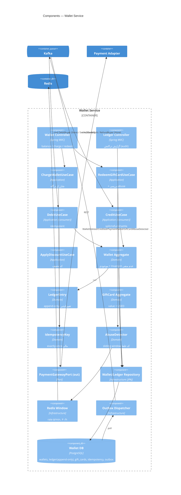
```mermaid
C4Component
    title Components — Wallet Service

    Container_Boundary(wallet, "Wallet Service") {
        Component(walletApi, "Wallet Controller", "Spring MVC", "balance / charge / redeem")
        Component(ledgerApi, "Ledger Controller", "Spring MVC", "گزارش تراکنش (audit)")
        Component(chargeUC, "ChargeWalletUseCase", "Application", "شارژ از درگاه")
        Component(redeemUC, "RedeemGiftCardUseCase", "Application", "+ بررسی abuse")
        Component(debitUC, "DebitUseCase", "Application (consumer)", "idempotent")
        Component(creditUC, "CreditUseCase", "Application (consumer)", "split/refund/settle")
        Component(discountUC, "ApplyDiscountUseCase", "Application", "کد تخفیف")
        Component(walletAgg, "Wallet Aggregate", "Domain", "موجودی + Invariant عدم منفی")
        Component(ledger, "LedgerEntry", "Domain", "append-only، تغییرناپذیر")
        Component(giftcard, "GiftCard Aggregate", "Domain", "value + USED")
        Component(idem, "IdempotencyKey", "Domain", "exactly-once مالی")
        Component(abuse, "AbuseDetector", "Domain", "sliding window کد غلط")
        Component(pspPort, "PaymentGatewayPort (out)", "Port", "")
        Component(repo, "Wallet/Ledger Repository", "Infrastructure (JPA)", "")
        Component(window, "Redis Window", "Infrastructure", "rate ۵/min، ۳۰/h")
        Component(outbox, "Outbox Dispatcher", "Infrastructure", "")
        ComponentDb(db, "Wallet DB", "PostgreSQL", "wallets, ledger(append-only), gift_cards, idempotency, outbox")
    }
    ContainerQueue(kafka, "Kafka", "", "")
    Container(psp, "Payment Adapter", "", "")
    ContainerDb(redis, "Redis", "", "")

    Rel(walletApi, chargeUC, "")
    Rel(walletApi, redeemUC, "")
    Rel(redeemUC, abuse, "")
    Rel(abuse, window, "")
    Rel(window, redis, "")
    Rel(chargeUC, pspPort, "")
    Rel(pspPort, psp, "REST")
    Rel(debitUC, walletAgg, "")
    Rel(creditUC, walletAgg, "")
    Rel(debitUC, idem, "")
    Rel(walletAgg, ledger, "ثبت")
    Rel(walletAgg, repo, "")
    Rel(giftcard, repo, "")
    Rel(repo, db, "")
    Rel(ledgerApi, repo, "")
    Rel(kafka, debitUC, "cmd DebitBuyer (Store) / Settle (Market)")
    Rel(kafka, creditUC, "cmd CreditSplit / RefundBuyer (Store)")
    Rel(outbox, kafka, "WalletDebited/Credited/PaymentFailed/GiftCardAbuseDetected")
    Rel(db, outbox, "poll")

    UpdateLayoutConfig($c4ShapeInRow="4")
```

### الف-۶) Payment Gateway Adapter

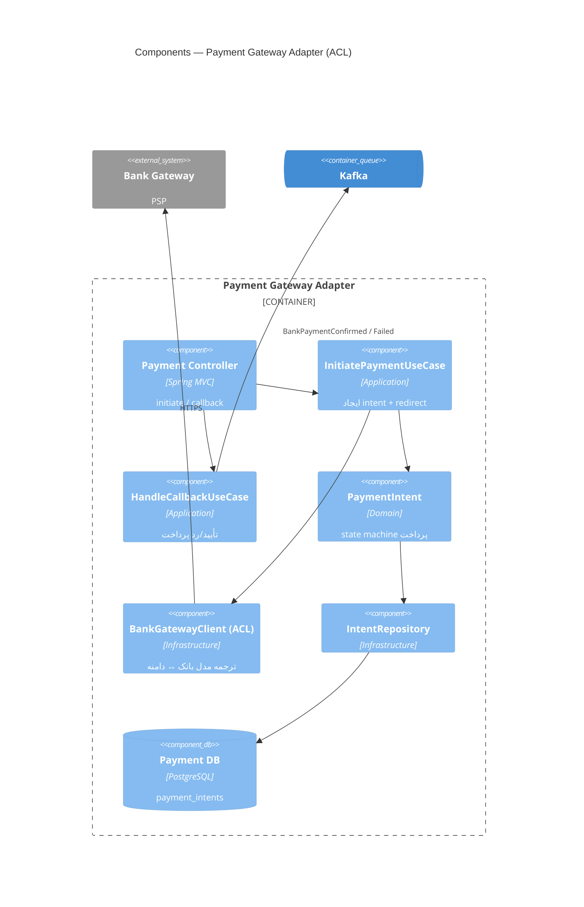
```mermaid
C4Component
    title Components — Payment Gateway Adapter (ACL)

    Container_Boundary(psp, "Payment Gateway Adapter") {
        Component(payApi, "Payment Controller", "Spring MVC", "initiate / callback")
        Component(initUC, "InitiatePaymentUseCase", "Application", "ایجاد intent + redirect")
        Component(cbUC, "HandleCallbackUseCase", "Application", "تأیید/رد پرداخت")
        Component(intent, "PaymentIntent", "Domain", "state machine پرداخت")
        Component(acl, "BankGatewayClient (ACL)", "Infrastructure", "ترجمه مدل بانک ↔ دامنه")
        Component(repo, "IntentRepository", "Infrastructure", "")
        ComponentDb(db, "Payment DB", "PostgreSQL", "payment_intents")
    }
    System_Ext(bank, "Bank Gateway", "PSP")
    ContainerQueue(kafka, "Kafka", "", "")

    Rel(payApi, initUC, "")
    Rel(payApi, cbUC, "")
    Rel(initUC, intent, "")
    Rel(initUC, acl, "")
    Rel(acl, bank, "HTTPS")
    Rel(intent, repo, "")
    Rel(repo, db, "")
    Rel(cbUC, kafka, "BankPaymentConfirmed / Failed")

    UpdateLayoutConfig($c4ShapeInRow="4")
```

### الف-۷) Marketplace Service

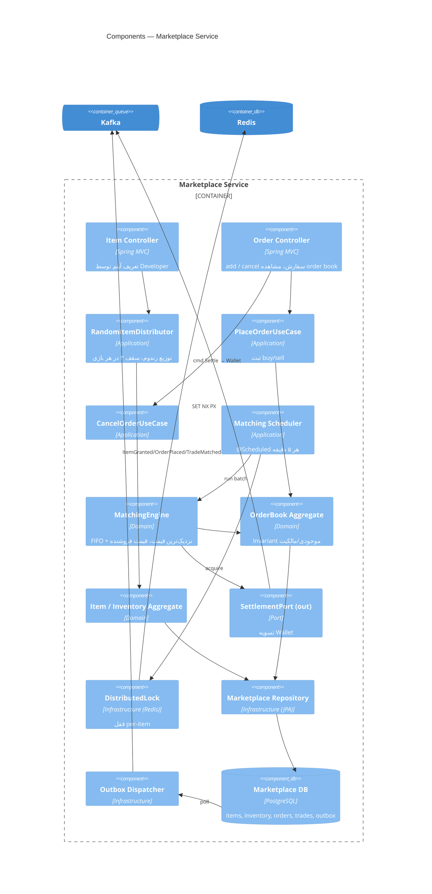
```mermaid
C4Component
    title Components — Marketplace Service

    Container_Boundary(market, "Marketplace Service") {
        Component(itemApi, "Item Controller", "Spring MVC", "تعریف آیتم توسط Developer")
        Component(orderApi, "Order Controller", "Spring MVC", "add / cancel سفارش، مشاهده order book")
        Component(distributor, "RandomItemDistributor", "Application", "توزیع رندوم، سقف ۳ در هر بازی")
        Component(placeUC, "PlaceOrderUseCase", "Application", "ثبت buy/sell")
        Component(cancelUC, "CancelOrderUseCase", "Application", "")
        Component(scheduler, "Matching Scheduler", "Application", "@Scheduled هر ۵ دقیقه")
        Component(matcher, "MatchingEngine", "Domain", "FIFO + نزدیک‌ترین قیمت، قیمت فروشنده")
        Component(orderBook, "OrderBook Aggregate", "Domain", "Invariant موجودی/مالکیت")
        Component(itemAgg, "Item / Inventory Aggregate", "Domain", "")
        Component(settlePort, "SettlementPort (out)", "Port", "تسویه Wallet")
        Component(lock, "DistributedLock", "Infrastructure (Redis)", "قفل per-item")
        Component(repo, "Marketplace Repository", "Infrastructure (JPA)", "")
        Component(outbox, "Outbox Dispatcher", "Infrastructure", "")
        ComponentDb(db, "Marketplace DB", "PostgreSQL", "items, inventory, orders, trades, outbox")
    }
    ContainerQueue(kafka, "Kafka", "", "")
    ContainerDb(redis, "Redis", "", "")

    Rel(itemApi, distributor, "")
    Rel(orderApi, placeUC, "")
    Rel(orderApi, cancelUC, "")
    Rel(distributor, itemAgg, "")
    Rel(placeUC, orderBook, "")
    Rel(scheduler, lock, "acquire")
    Rel(scheduler, matcher, "run batch")
    Rel(matcher, orderBook, "")
    Rel(matcher, settlePort, "")
    Rel(lock, redis, "SET NX PX")
    Rel(orderBook, repo, "")
    Rel(itemAgg, repo, "")
    Rel(repo, db, "")
    Rel(settlePort, kafka, "cmd Settle → Wallet")
    Rel(outbox, kafka, "ItemGranted/OrderPlaced/TradeMatched")
    Rel(db, outbox, "poll")

    UpdateLayoutConfig($c4ShapeInRow="4")
```

### الف-۸) Review Service

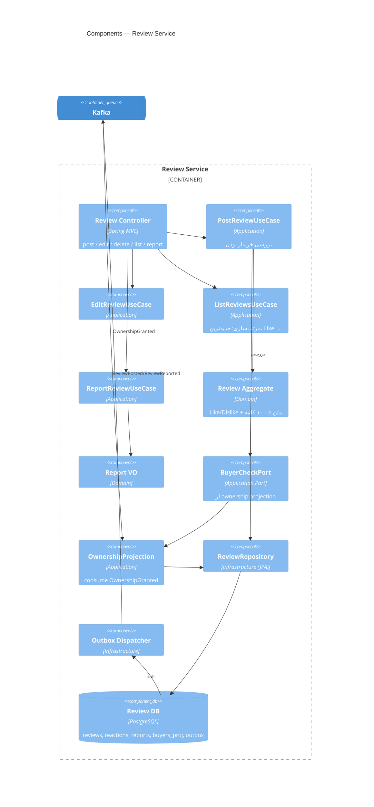
```mermaid
C4Component
    title Components — Review Service

    Container_Boundary(review, "Review Service") {
        Component(reviewApi, "Review Controller", "Spring MVC", "post / edit / delete / list / report")
        Component(postUC, "PostReviewUseCase", "Application", "بررسی خریدار بودن")
        Component(editUC, "EditReviewUseCase", "Application", "")
        Component(listUC, "ListReviewsUseCase", "Application", "مرتب‌سازی: جدیدترین، Like، …")
        Component(reportUC, "ReportReviewUseCase", "Application", "")
        Component(reviewAgg, "Review Aggregate", "Domain", "Like/Dislike + متن ≤۱۰۰۰ کلمه")
        Component(reportVO, "Report VO", "Domain", "")
        Component(buyerPort, "BuyerCheckPort", "Application Port", "از ownership projection")
        Component(ownProj, "OwnershipProjection", "Application", "consume OwnershipGranted")
        Component(repo, "ReviewRepository", "Infrastructure (JPA)", "")
        Component(outbox, "Outbox Dispatcher", "Infrastructure", "")
        ComponentDb(db, "Review DB", "PostgreSQL", "reviews, reactions, reports, buyers_proj, outbox")
    }
    ContainerQueue(kafka, "Kafka", "", "")

    Rel(reviewApi, postUC, "")
    Rel(reviewApi, editUC, "")
    Rel(reviewApi, listUC, "")
    Rel(reviewApi, reportUC, "")
    Rel(postUC, buyerPort, "بررسی")
    Rel(buyerPort, ownProj, "")
    Rel(postUC, reviewAgg, "")
    Rel(reportUC, reportVO, "")
    Rel(reviewAgg, repo, "")
    Rel(ownProj, repo, "")
    Rel(repo, db, "")
    Rel(kafka, ownProj, "OwnershipGranted")
    Rel(outbox, kafka, "ReviewPosted/ReviewReported")
    Rel(db, outbox, "poll")

    UpdateLayoutConfig($c4ShapeInRow="4")
```

### الف-۹) Community Service

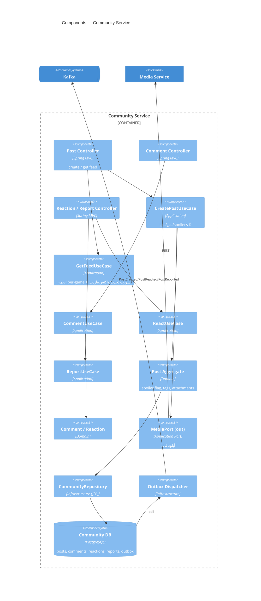
```mermaid
C4Component
    title Components — Community Service

    Container_Boundary(community, "Community Service") {
        Component(postApi, "Post Controller", "Spring MVC", "create / get feed")
        Component(commentApi, "Comment Controller", "Spring MVC", "")
        Component(reactApi, "Reaction / Report Controller", "Spring MVC", "")
        Component(createUC, "CreatePostUseCase", "Application", "متن/مدیا/spoiler/تگ")
        Component(feedUC, "GetFeedUseCase", "Application", "انجمن per-game + سورت (جدید/واکنش/بازدید)")
        Component(commentUC, "CommentUseCase", "Application", "")
        Component(reactUC, "ReactUseCase", "Application", "")
        Component(reportUC, "ReportUseCase", "Application", "")
        Component(postAgg, "Post Aggregate", "Domain", "spoiler flag, tags, attachments")
        Component(comment, "Comment / Reaction", "Domain", "")
        Component(mediaPort, "MediaPort (out)", "Application Port", "آپلود فایل")
        Component(repo, "CommunityRepository", "Infrastructure (JPA)", "")
        Component(outbox, "Outbox Dispatcher", "Infrastructure", "")
        ComponentDb(db, "Community DB", "PostgreSQL", "posts, comments, reactions, reports, outbox")
    }
    ContainerQueue(kafka, "Kafka", "", "")
    Container(media, "Media Service", "", "")

    Rel(postApi, createUC, "")
    Rel(postApi, feedUC, "")
    Rel(commentApi, commentUC, "")
    Rel(reactApi, reactUC, "")
    Rel(reactApi, reportUC, "")
    Rel(createUC, postAgg, "")
    Rel(createUC, mediaPort, "")
    Rel(mediaPort, media, "REST")
    Rel(commentUC, comment, "")
    Rel(postAgg, repo, "")
    Rel(repo, db, "")
    Rel(outbox, kafka, "PostCreated/PostReacted/PostReported")
    Rel(db, outbox, "poll")

    UpdateLayoutConfig($c4ShapeInRow="4")
```

### الف-۱۰) Search Service (CQRS read side)

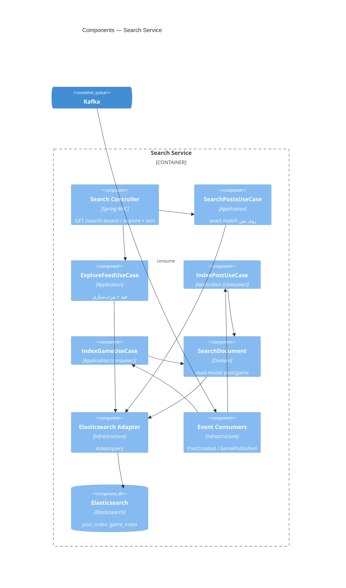
```mermaid
C4Component
    title Components — Search Service

    Container_Boundary(search, "Search Service") {
        Component(searchApi, "Search Controller", "Spring MVC", "GET /search (exact) / explore + sort")
        Component(searchUC, "SearchPostsUseCase", "Application", "exact match روی متن")
        Component(exploreUC, "ExploreFeedUseCase", "Application", "فید + مرتب‌سازی")
        Component(indexPostUC, "IndexPostUseCase", "Application (consumer)", "")
        Component(indexGameUC, "IndexGameUseCase", "Application (consumer)", "")
        Component(doc, "SearchDocument", "Domain", "read-model post/game")
        Component(esAdapter, "Elasticsearch Adapter", "Infrastructure", "index/query")
        Component(cons, "Event Consumers", "Infrastructure", "PostCreated / GamePublished")
        ComponentDb(es, "Elasticsearch", "Elasticsearch", "post_index, game_index")
    }
    ContainerQueue(kafka, "Kafka", "", "")

    Rel(searchApi, searchUC, "")
    Rel(searchApi, exploreUC, "")
    Rel(searchUC, esAdapter, "")
    Rel(exploreUC, esAdapter, "")
    Rel(indexPostUC, doc, "")
    Rel(indexGameUC, doc, "")
    Rel(doc, esAdapter, "")
    Rel(esAdapter, es, "")
    Rel(kafka, cons, "consume")
    Rel(cons, indexPostUC, "")
    Rel(cons, indexGameUC, "")

    UpdateLayoutConfig($c4ShapeInRow="4")
```

### الف-۱۱) Festival Service

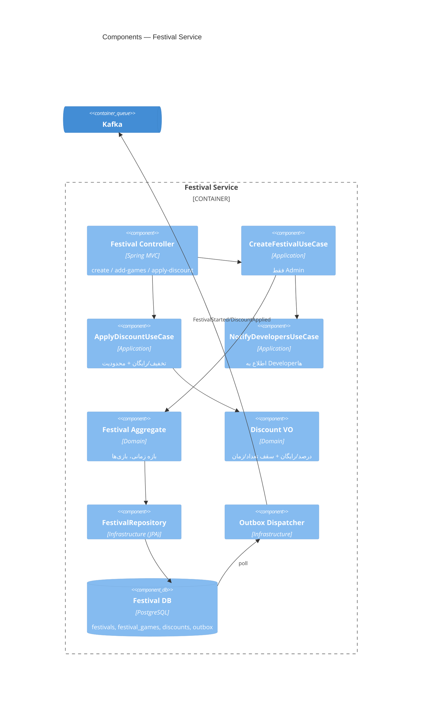
```mermaid
C4Component
    title Components — Festival Service

    Container_Boundary(festival, "Festival Service") {
        Component(festApi, "Festival Controller", "Spring MVC", "create / add-games / apply-discount")
        Component(createUC, "CreateFestivalUseCase", "Application", "فقط Admin")
        Component(discountUC, "ApplyDiscountUseCase", "Application", "تخفیف/رایگان + محدودیت")
        Component(notifyUC, "NotifyDevelopersUseCase", "Application", "اطلاع به Developerها")
        Component(festAgg, "Festival Aggregate", "Domain", "بازه زمانی، بازی‌ها")
        Component(discountVO, "Discount VO", "Domain", "درصد/رایگان + سقف تعداد/زمان")
        Component(repo, "FestivalRepository", "Infrastructure (JPA)", "")
        Component(outbox, "Outbox Dispatcher", "Infrastructure", "")
        ComponentDb(db, "Festival DB", "PostgreSQL", "festivals, festival_games, discounts, outbox")
    }
    ContainerQueue(kafka, "Kafka", "", "")

    Rel(festApi, createUC, "")
    Rel(festApi, discountUC, "")
    Rel(createUC, festAgg, "")
    Rel(discountUC, discountVO, "")
    Rel(createUC, notifyUC, "")
    Rel(festAgg, repo, "")
    Rel(repo, db, "")
    Rel(outbox, kafka, "FestivalStarted/DiscountApplied")
    Rel(db, outbox, "poll")

    UpdateLayoutConfig($c4ShapeInRow="4")
```

### الف-۱۲) Recommendation Service

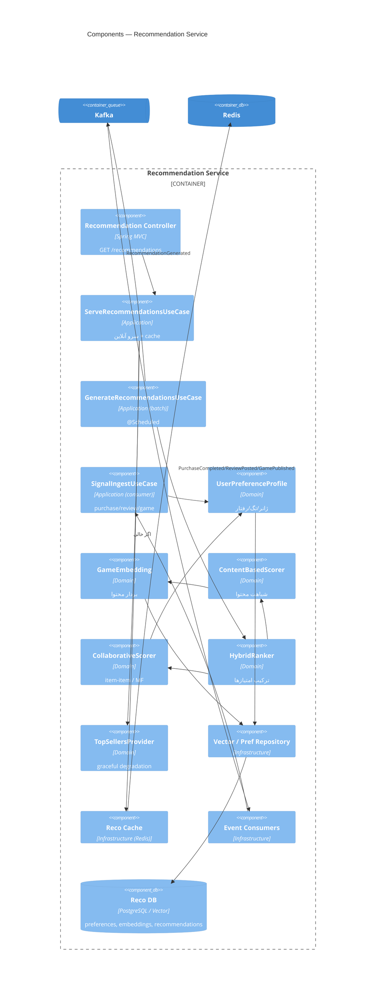
```mermaid
C4Component
    title Components — Recommendation Service

    Container_Boundary(reco, "Recommendation Service") {
        Component(recoApi, "Recommendation Controller", "Spring MVC", "GET /recommendations")
        Component(serveUC, "ServeRecommendationsUseCase", "Application", "سرو آنلاین + cache")
        Component(genUC, "GenerateRecommendationsUseCase", "Application (batch)", "@Scheduled")
        Component(ingestUC, "SignalIngestUseCase", "Application (consumer)", "purchase/review/game")
        Component(prefProfile, "UserPreferenceProfile", "Domain", "ژانر/تگ/رفتار")
        Component(embedding, "GameEmbedding", "Domain", "بردار محتوا")
        Component(contentScorer, "ContentBasedScorer", "Domain", "شباهت محتوا")
        Component(collabScorer, "CollaborativeScorer", "Domain", "item-item / MF")
        Component(ranker, "HybridRanker", "Domain", "ترکیب امتیازها")
        Component(fallback, "TopSellersProvider", "Domain", "graceful degradation")
        Component(repo, "Vector / Pref Repository", "Infrastructure", "")
        Component(cache, "Reco Cache", "Infrastructure (Redis)", "")
        Component(cons, "Event Consumers", "Infrastructure", "")
        ComponentDb(db, "Reco DB", "PostgreSQL / Vector", "preferences, embeddings, recommendations")
    }
    ContainerQueue(kafka, "Kafka", "", "")
    ContainerDb(redis, "Redis", "", "")

    Rel(recoApi, serveUC, "")
    Rel(serveUC, cache, "")
    Rel(serveUC, fallback, "اگر خالی")
    Rel(cache, redis, "")
    Rel(genUC, ranker, "")
    Rel(ranker, contentScorer, "")
    Rel(ranker, collabScorer, "")
    Rel(contentScorer, embedding, "")
    Rel(collabScorer, prefProfile, "")
    Rel(ingestUC, prefProfile, "")
    Rel(prefProfile, repo, "")
    Rel(embedding, repo, "")
    Rel(repo, db, "")
    Rel(kafka, cons, "PurchaseCompleted/ReviewPosted/GamePublished")
    Rel(cons, ingestUC, "")
    Rel(genUC, kafka, "RecommendationGenerated")

    UpdateLayoutConfig($c4ShapeInRow="4")
```

### الف-۱۳) Notification Service

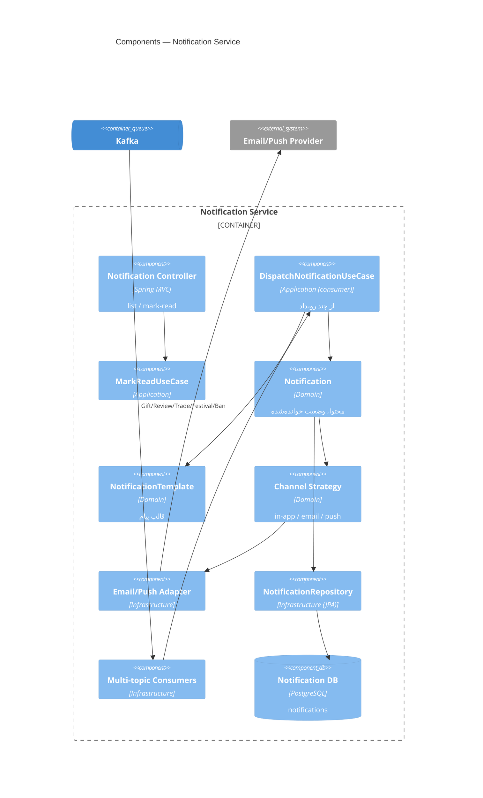
```mermaid
C4Component
    title Components — Notification Service

    Container_Boundary(notif, "Notification Service") {
        Component(notifApi, "Notification Controller", "Spring MVC", "list / mark-read")
        Component(dispatchUC, "DispatchNotificationUseCase", "Application (consumer)", "از چند رویداد")
        Component(readUC, "MarkReadUseCase", "Application", "")
        Component(notifAgg, "Notification", "Domain", "محتوا، وضعیت خوانده‌شده")
        Component(template, "NotificationTemplate", "Domain", "قالب پیام")
        Component(channel, "Channel Strategy", "Domain", "in-app / email / push")
        Component(emailAd, "Email/Push Adapter", "Infrastructure", "")
        Component(repo, "NotificationRepository", "Infrastructure (JPA)", "")
        Component(cons, "Multi-topic Consumers", "Infrastructure", "")
        ComponentDb(db, "Notification DB", "PostgreSQL", "notifications")
    }
    ContainerQueue(kafka, "Kafka", "", "")
    System_Ext(ext, "Email/Push Provider", "")

    Rel(notifApi, readUC, "")
    Rel(dispatchUC, notifAgg, "")
    Rel(dispatchUC, template, "")
    Rel(notifAgg, channel, "")
    Rel(channel, emailAd, "")
    Rel(emailAd, ext, "")
    Rel(notifAgg, repo, "")
    Rel(repo, db, "")
    Rel(kafka, cons, "Gift/Review/Trade/Festival/Ban")
    Rel(cons, dispatchUC, "")

    UpdateLayoutConfig($c4ShapeInRow="4")
```

### الف-۱۴) Media Service

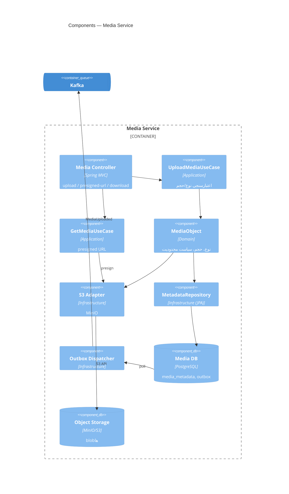
```mermaid
C4Component
    title Components — Media Service

    Container_Boundary(media, "Media Service") {
        Component(mediaApi, "Media Controller", "Spring MVC", "upload / presigned-url / download")
        Component(uploadUC, "UploadMediaUseCase", "Application", "اعتبارسنجی نوع/حجم")
        Component(getUC, "GetMediaUseCase", "Application", "presigned URL")
        Component(mediaObj, "MediaObject", "Domain", "نوع، حجم، سیاست محدودیت")
        Component(s3, "S3 Adapter", "Infrastructure", "MinIO")
        Component(repo, "MetadataRepository", "Infrastructure (JPA)", "")
        Component(outbox, "Outbox Dispatcher", "Infrastructure", "")
        ComponentDb(db, "Media DB", "PostgreSQL", "media_metadata, outbox")
        ComponentDb(minio, "Object Storage", "MinIO/S3", "blobها")
    }
    ContainerQueue(kafka, "Kafka", "", "")

    Rel(mediaApi, uploadUC, "")
    Rel(mediaApi, getUC, "")
    Rel(uploadUC, mediaObj, "")
    Rel(mediaObj, s3, "")
    Rel(s3, minio, "S3 API")
    Rel(mediaObj, repo, "")
    Rel(repo, db, "")
    Rel(getUC, s3, "presign")
    Rel(outbox, kafka, "MediaUploaded")
    Rel(db, outbox, "poll")

    UpdateLayoutConfig($c4ShapeInRow="4")
```

---

## ب) Sequence / Flow Diagrams

> چهار Saga اصلی (خرید/هدیه، مرجوعی، matching، state machine انتشار) در مستند اصلی آمده‌اند. این بخش بقیه‌ی جریان‌ها را کامل می‌کند.

### ب-۱) ثبت‌نام + تأیید Support

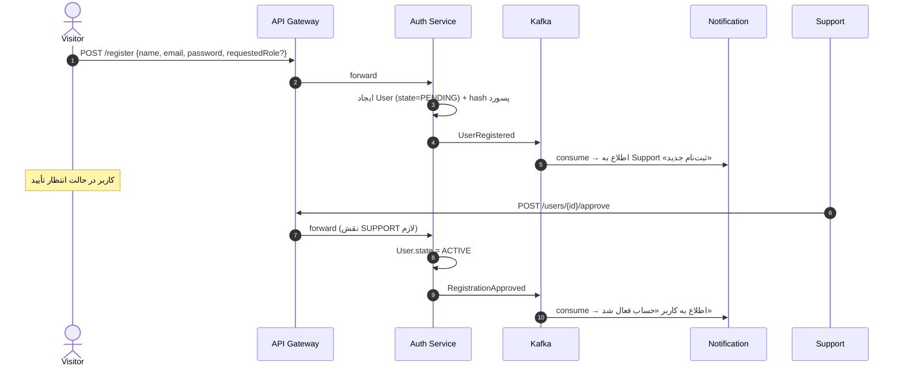
```mermaid
sequenceDiagram
    autonumber
    actor U as Visitor
    participant GW as API Gateway
    participant A as Auth Service
    participant K as Kafka
    participant N as Notification
    participant S as Support

    U->>GW: POST /register {name, email, password, requestedRole?}
    GW->>A: forward
    A->>A: ایجاد User (state=PENDING) + hash پسورد
    A->>K: UserRegistered
    K->>N: consume → اطلاع به Support «ثبت‌نام جدید»
    Note over U: کاربر در حالت انتظار تأیید
    S->>GW: POST /users/{id}/approve
    GW->>A: forward (نقش SUPPORT لازم)
    A->>A: User.state = ACTIVE
    A->>K: RegistrationApproved
    K->>N: consume → اطلاع به کاربر «حساب فعال شد»
```

### ب-۲) درخواست نقش Developer/Support + تأیید/رد

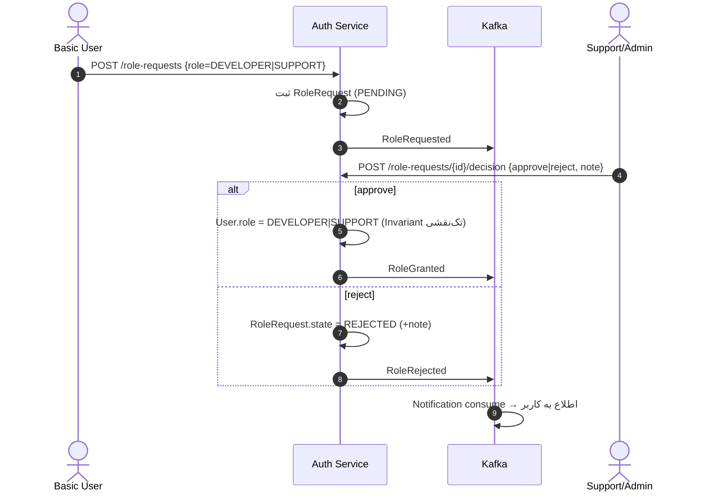
```mermaid
sequenceDiagram
    autonumber
    actor U as Basic User
    participant A as Auth Service
    participant K as Kafka
    actor SA as Support/Admin

    U->>A: POST /role-requests {role=DEVELOPER|SUPPORT}
    A->>A: ثبت RoleRequest (PENDING)
    A->>K: RoleRequested
    SA->>A: POST /role-requests/{id}/decision {approve|reject, note}
    alt approve
        A->>A: User.role = DEVELOPER|SUPPORT (Invariant تک‌نقشی)
        A->>K: RoleGranted
    else reject
        A->>A: RoleRequest.state = REJECTED (+note)
        A->>K: RoleRejected
    end
    K->>K: Notification consume → اطلاع به کاربر
```

### ب-۳) شارژ کیف پول از درگاه بانکی

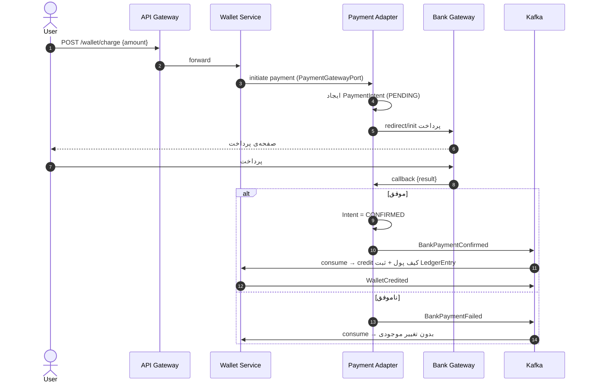
```mermaid
sequenceDiagram
    autonumber
    actor U as User
    participant GW as API Gateway
    participant W as Wallet Service
    participant P as Payment Adapter
    participant B as Bank Gateway
    participant K as Kafka

    U->>GW: POST /wallet/charge {amount}
    GW->>W: forward
    W->>P: initiate payment (PaymentGatewayPort)
    P->>P: ایجاد PaymentIntent (PENDING)
    P->>B: redirect/init پرداخت
    B-->>U: صفحه‌ی پرداخت
    U->>B: پرداخت
    B->>P: callback {result}
    alt موفق
        P->>P: Intent = CONFIRMED
        P->>K: BankPaymentConfirmed
        K->>W: consume → credit کیف پول + ثبت LedgerEntry
        W->>K: WalletCredited
    else ناموفق
        P->>K: BankPaymentFailed
        K->>W: consume → بدون تغییر موجودی
    end
```

### ب-۴) استفاده از گیفت‌کارت + تشخیص abuse و ban

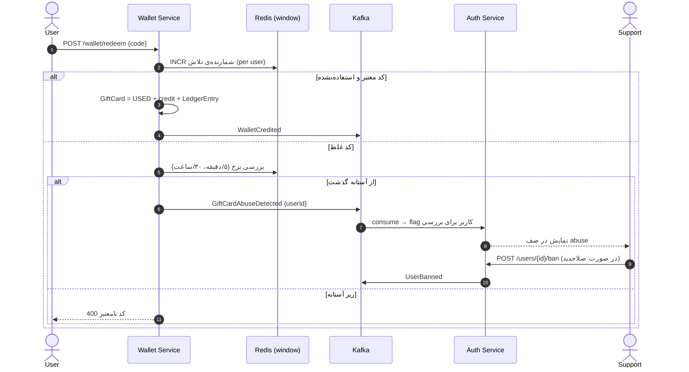
```mermaid
sequenceDiagram
    autonumber
    actor U as User
    participant W as Wallet Service
    participant R as Redis (window)
    participant K as Kafka
    participant A as Auth Service
    actor S as Support

    U->>W: POST /wallet/redeem {code}
    W->>R: INCR شمارنده‌ی تلاش (per user)
    alt کد معتبر و استفاده‌نشده
        W->>W: GiftCard = USED + credit + LedgerEntry
        W->>K: WalletCredited
    else کد غلط
        W->>R: بررسی نرخ (۵/دقیقه، ۳۰/ساعت)
        alt از آستانه گذشت
            W->>K: GiftCardAbuseDetected {userId}
            K->>A: consume → flag کاربر برای بررسی
            A-->>S: نمایش در صف abuse
            S->>A: POST /users/{id}/ban (در صورت صلاحدید)
            A->>K: UserBanned
        else زیر آستانه
            W-->>U: 400 کد نامعتبر
        end
    end
```

### ب-۵) چرخه‌ی کامل انتشار بازی (Sequence)

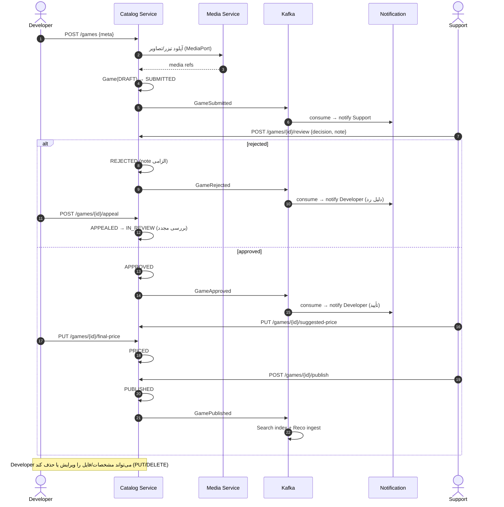
```mermaid
sequenceDiagram
    autonumber
    actor D as Developer
    participant C as Catalog Service
    participant M as Media Service
    participant K as Kafka
    participant N as Notification
    actor S as Support

    D->>C: POST /games {meta}
    C->>M: آپلود تیزر/تصاویر (MediaPort)
    M-->>C: media refs
    C->>C: Game(DRAFT) → SUBMITTED
    C->>K: GameSubmitted
    K->>N: consume → notify Support
    S->>C: POST /games/{id}/review {decision, note}
    alt rejected
        C->>C: REJECTED (note الزامی)
        C->>K: GameRejected
        K->>N: consume → notify Developer (دلیل رد)
        D->>C: POST /games/{id}/appeal
        C->>C: APPEALED → IN_REVIEW (بررسی مجدد)
    else approved
        C->>C: APPROVED
        C->>K: GameApproved
        K->>N: consume → notify Developer (تأیید)
        S->>C: PUT /games/{id}/suggested-price
        D->>C: PUT /games/{id}/final-price
        C->>C: PRICED
        S->>C: POST /games/{id}/publish
        C->>C: PUBLISHED
        C->>K: GamePublished
        K->>K: Search index + Reco ingest
    end
    Note over D,C: Developer می‌تواند مشخصات/فایل را ویرایش یا حذف کند (PUT/DELETE)
```

### ب-۶) ثبت نظر با بررسی خریدار بودن

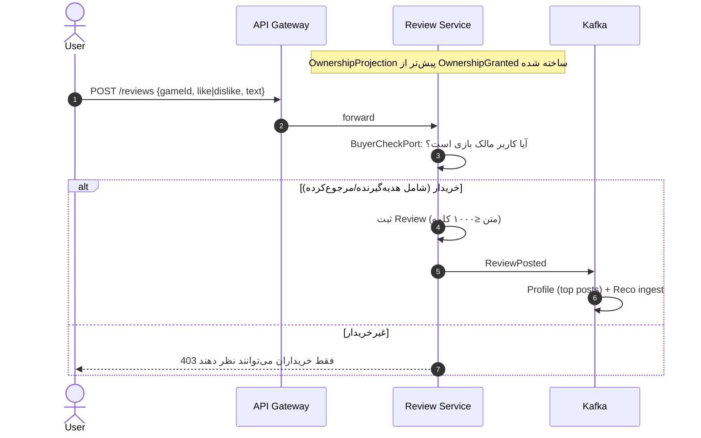
```mermaid
sequenceDiagram
    autonumber
    actor U as User
    participant GW as API Gateway
    participant R as Review Service
    participant K as Kafka

    Note over R: OwnershipProjection پیش‌تر از OwnershipGranted ساخته شده
    U->>GW: POST /reviews {gameId, like|dislike, text}
    GW->>R: forward
    R->>R: BuyerCheckPort: آیا کاربر مالک بازی است؟
    alt خریدار (شامل هدیه‌گیرنده/مرجوع‌کرده)
        R->>R: ثبت Review (متن ≤۱۰۰۰ کلمه)
        R->>K: ReviewPosted
        K->>K: Profile (top posts) + Reco ingest
    else غیرخریدار
        R-->>U: 403 فقط خریداران می‌توانند نظر دهند
    end
```

### ب-۷) ایجاد پست + آپلود مدیا + ایندکس جستجو (Choreography)

```mermaid
sequenceDiagram
    autonumber
    actor U as User
    participant Cm as Community Service
    participant Md as Media Service
    participant Mo as Object Storage
    participant K as Kafka
    participant Se as Search Service
    participant Pr as Profile Service

    U->>Cm: POST /posts {text, spoiler, tags, files}
    Cm->>Md: upload (MediaPort)
    Md->>Mo: ذخیره blob
    Md->>K: MediaUploaded
    Md-->>Cm: media refs
    Cm->>Cm: ثبت Post
    Cm->>K: PostCreated
    par ایندکس جستجو
        K->>Se: consume → ایندکس در Elasticsearch (exact-match)
    and پروفایل
        K->>Pr: consume → به‌روزرسانی ۵ پست برتر
    end
```

### ب-۸) ایجاد جشنواره + تخفیف + اطلاع به Developerها

```mermaid
sequenceDiagram
    autonumber
    actor Ad as Admin
    participant F as Festival Service
    participant K as Kafka
    participant C as Catalog Service
    participant N as Notification

    Ad->>F: POST /festivals {name, period, games[], discount}
    F->>F: ایجاد Festival + Discount VO
    F->>K: FestivalStarted
    F->>K: DiscountApplied {gameIds, percent|free}
    par قیمت‌گذاری مؤثر
        K->>C: consume → اعمال قیمت تخفیف‌خورده روی نمایش بازی
    and اطلاع‌رسانی
        K->>N: consume → notify Developerهای درگیر
    end
```

### ب-۹) تولید و سرو پیشنهاد (Recommendation)

```mermaid
sequenceDiagram
    autonumber
    participant K as Kafka
    participant Rc as Recommendation Service
    participant Rd as Redis (cache)
    participant DB as Reco DB
    actor U as User
    participant GW as API Gateway

    rect rgb(235,245,255)
    note right of K: مسیر ingest (پیوسته)
    K->>Rc: PurchaseCompleted / ReviewPosted / GamePublished
    Rc->>DB: به‌روزرسانی UserPreferenceProfile + GameEmbedding
    end

    rect rgb(235,255,235)
    note right of Rc: مسیر batch (@Scheduled)
    Rc->>DB: خواندن سیگنال‌ها
    Rc->>Rc: HybridRanker (content + collaborative)
    Rc->>Rd: کش نتایج per user
    Rc->>K: RecommendationGenerated
    end

    rect rgb(255,245,235)
    note right of U: مسیر سرو (آنلاین)
    U->>GW: GET /recommendations
    GW->>Rc: forward
    Rc->>Rd: خواندن از cache
    alt cache موجود
        Rc-->>U: لیست پیشنهاد
    else خالی / سرویس افت کرده
        Rc-->>U: fallback = پرفروش‌ها (graceful degradation)
    end
    end
```

### ب-۱۰) به‌روزرسانی وضعیت آنلاین (Presence — real-time)

```mermaid
sequenceDiagram
    autonumber
    actor U as User (browser)
    participant P as Profile Service
    participant R as Redis (TTL)
    participant K as Kafka

    U->>P: WebSocket connect + heartbeat (هر ~۱۵s)
    P->>R: SET presence:{userId} = online EX 30s
    P->>K: PresenceChanged {online}
    Note over R: اگر heartbeat قطع شود، کلید با TTL منقضی می‌شود
    loop انقضای TTL
        R-->>P: کلید حذف شد → offline
        P->>K: PresenceChanged {offline}
    end
```

### ب-۱۱) توزیع رندوم آیتم (سقف ۳ در هر بازی)

```mermaid
sequenceDiagram
    autonumber
    actor D as Developer
    participant M as Marketplace Service
    participant DB as Marketplace DB
    participant K as Kafka

    D->>M: POST /games/{id}/items {title, image, desc}
    M->>M: ثبت تعریف آیتم
    M->>M: RandomItemDistributor: انتخاب کاربران واجد شرایط
    loop برای هر کاربر منتخب
        M->>DB: بررسی موجودی فعلی کاربر در این بازی
        alt کمتر از ۳ آیتم
            M->>DB: grant آیتم به کاربر
            M->>K: ItemGranted
        else به سقف ۳ رسیده
            M->>M: رد شدن، انتخاب کاربر بعدی
        end
    end
```

---

## ج) توپولوژی رویدادها (Event Choreography)

نقشه‌ی producer/consumer روی topicهای Kafka. هر سرویس از **Outbox** publish می‌کند و consumerها **idempotent** هستند؛ رویدادهای مسموم به **DLQ** می‌روند. برای خوانایی، توپولوژی به دو نمای مجزا تقسیم شده است: **(ج-۱) جریان مالی** (Saga محور) و **(ج-۲) جریان محتوا/رشد** (fan-out به read-modelها).

### ج-۱) جریان رویدادهای مالی (Saga محور)

گام‌های شماره‌گذاری‌شده ترتیب Saga خرید را نشان می‌دهند؛ فلش‌های پایین‌رو **command** و بالارو **reply/event** هستند.

```mermaid
flowchart LR
    classDef svc fill:#e3f2fd,stroke:#1565c0,stroke-width:1px;
    classDef money fill:#ffe0b2,stroke:#e65100,stroke-width:2px;
    classDef ext fill:#eceff1,stroke:#546e7a,stroke-width:1px;

    Store([Store / Saga Orchestrator]):::money
    Wallet([Wallet]):::money
    Catalog([Catalog]):::svc
    PSP([Payment Adapter]):::svc
    Market([Marketplace]):::money
    Bank[(Bank Gateway)]:::ext
    Notif([Notification]):::svc
    Auth([Auth]):::svc

    Store -->|1 . cmd DebitBuyer| Wallet
    Wallet -->|2 . WalletDebited / PaymentFailed| Store
    Store -->|3 . cmd GrantOwnership| Catalog
    Catalog -->|4 . OwnershipGranted| Store
    Store -->|5 . cmd CreditSplit 70/30| Wallet
    Wallet -->|6 . WalletCredited| Store
    Store -->|7 . PurchaseCompleted| Notif

    Wallet -->|charge| PSP
    PSP -->|pay| Bank
    PSP -->|BankPaymentConfirmed| Wallet
    Market -->|cmd Settle trade| Wallet
    Wallet -->|GiftCardAbuseDetected| Auth
```

### ج-۲) جریان رویدادهای محتوا و رشد (Read-model fan-out)

سه ستون: تولیدکننده‌ها (چپ) → topic (وسط) → مصرف‌کننده‌ها (راست). نودهای مصرف‌کننده‌ای که نقش دوگانه دارند با `*` مشخص شده‌اند.

```mermaid
flowchart LR
    classDef topic fill:#fff3e0,stroke:#e65100,stroke-width:1px;
    classDef svc fill:#e3f2fd,stroke:#1565c0,stroke-width:1px;

    %% Producers (left)
    Auth([Auth]):::svc
    Catalog([Catalog]):::svc
    Community([Community]):::svc
    Review([Review]):::svc
    Festival([Festival]):::svc
    Media([Media]):::svc

    %% Topics (middle)
    UE{{user-events}}:::topic
    GE{{game-events + Ownership}}:::topic
    CE{{community-events}}:::topic
    RE{{review-events}}:::topic
    FE{{festival-events}}:::topic
    ME{{media-events}}:::topic

    %% Consumers (right)
    Profile([Profile]):::svc
    Search([Search]):::svc
    Reco([Recommendation]):::svc
    Notif([Notification]):::svc
    cWallet([Wallet *]):::svc
    cCatalog([Catalog *]):::svc

    Auth --> UE
    Catalog --> GE
    Community --> CE
    Review --> RE
    Festival --> FE
    Media --> ME

    UE --> Profile
    UE --> Reco
    UE --> Notif
    GE --> Search
    GE --> Reco
    GE --> Profile
    GE --> cWallet
    RE --> Profile
    RE --> Reco
    RE --> Notif
    CE --> Search
    CE --> Profile
    FE --> cCatalog
    FE --> Notif
    ME --> cCatalog
```

> `GE --> Wallet *`: رویداد `OwnershipGranted` (متعلق به Catalog) پلِ اتصال به Saga مالی در نمای ج-۱ است (Wallet برای واریز سهم آن را مصرف می‌کند).
> **DLQ:** topicهای مالی (`purchase`, `wallet`, `payment`, `trade`) هرکدام یک DLQ اختصاصی با retry + backoff دارند.

**Topicهای کلیدی و مالکیت:**

| Topic | Producer (owner) | Consumers اصلی | حساسیت |
|-------|------------------|----------------|---------|
| `purchase-events` | Store | Wallet, Notification, Reco | بالا (مالی) |
| `wallet-events` | Wallet | Store (saga), Catalog (grant), Auth (abuse), Notification | بالا (مالی) |
| `trade-events` | Marketplace | Wallet, Profile (inventory read-model), Notification | بالا (مالی) |
| `payment-events` | Payment Adapter | Wallet | بالا (مالی) |
| `game-events` | Catalog | Search, Reco, Festival, Profile, Wallet (credit), Review (buyer-proj) | متوسط |
| `user-events` | Auth | Profile, Notification, Reco | متوسط |
| `community-events` | Community | Search, Profile | پایین |
| `review-events` | Review | Profile, Reco, Notification | پایین |
| `festival-events` | Festival | Catalog, Notification | پایین |
| `media-events` | Media | Community, Catalog | پایین |
| `reco-events` | Recommendation | Profile | پایین |

---

## د) ER — دیتامدل هر سرویس

> هر سرویس DB مستقل دارد (Database-per-Service). ارجاع بین سرویس‌ها با **شناسه** است نه FK فیزیکی. جدول `outbox` در همه‌ی سرویس‌های نویسنده تکرار می‌شود و در ER تکرار نشده مگر برای یادآوری.

### د-۱) Auth DB

```mermaid
erDiagram
    USER ||--o{ ROLE_REQUEST : submits
    USER ||--o{ LOGIN_AUDIT : has
    USER {
        uuid id PK
        string email UK
        string password_hash
        string display_name
        enum role "BASIC_USER|DEVELOPER|SUPPORT|ADMIN"
        enum state "PENDING|ACTIVE|REJECTED|BANNED"
        timestamp created_at
    }
    ROLE_REQUEST {
        uuid id PK
        uuid user_id FK
        enum requested_role
        enum status "PENDING|APPROVED|REJECTED"
        string decision_note
        uuid decided_by
        timestamp created_at
    }
    LOGIN_AUDIT {
        uuid id PK
        uuid user_id FK
        string ip
        boolean success
        timestamp at
    }
```

### د-۲) Profile DB (read-model / CQRS)

```mermaid
erDiagram
    PROFILE ||--o{ OWNED_GAME : owns
    PROFILE ||--o{ OWNED_ITEM : holds
    PROFILE ||--o{ TOP_POST : features
    PROFILE {
        uuid user_id PK
        string display_name
        string avatar_url
        boolean online "از Redis sync"
        timestamp updated_at
    }
    OWNED_GAME {
        uuid id PK
        uuid user_id FK
        uuid game_id
        boolean hidden "مخفی از library عمومی"
        timestamp acquired_at
    }
    OWNED_ITEM {
        uuid id PK
        uuid user_id FK
        uuid item_id
        uuid game_id
        timestamp acquired_at
    }
    TOP_POST {
        uuid id PK
        uuid user_id FK
        uuid post_id
        int feedback_score
        int rank "1..5"
    }
```

### د-۳) Catalog DB

```mermaid
erDiagram
    GAME ||--o{ GAME_VERSION : has
    GAME ||--o{ GAME_MEDIA : has
    GAME ||--o{ REVIEW_WORKFLOW : undergoes
    GAME ||--o{ OWNERSHIP : grants
    GAME {
        uuid id PK
        uuid developer_id
        string title
        string description
        string min_requirements
        decimal final_price
        decimal suggested_price
        enum state "DRAFT|SUBMITTED|IN_REVIEW|APPROVED|REJECTED|APPEALED|PRICED|PUBLISHED"
        timestamp published_at
    }
    GAME_VERSION {
        uuid id PK
        uuid game_id FK
        string version
        string file_ref "Media id"
        timestamp uploaded_at
    }
    GAME_MEDIA {
        uuid id PK
        uuid game_id FK
        enum kind "TEASER|IMAGE"
        string media_ref
    }
    REVIEW_WORKFLOW {
        uuid id PK
        uuid game_id FK
        uuid support_id
        enum decision "APPROVED|REJECTED"
        string note "اجباری در رد"
        boolean appealed
        timestamp at
    }
    OWNERSHIP {
        uuid id PK
        uuid game_id FK
        uuid owner_id
        uuid order_id
        enum status "ACTIVE|REVOKED"
        timestamp granted_at
    }
```

### د-۴) Store / Order DB

```mermaid
erDiagram
    ORDER ||--|| SAGA_STATE : tracks
    ORDER ||--o| GIFT : may_have
    ORDER {
        uuid id PK
        uuid buyer_id
        uuid game_id
        decimal price
        decimal platform_cut "30%"
        decimal developer_cut "70%"
        enum type "PURCHASE|GIFT"
        enum state "PENDING|COMPLETED|FAILED|REFUNDED"
        timestamp created_at
    }
    GIFT {
        uuid id PK
        uuid order_id FK
        uuid recipient_id
        string message "<=500 words"
        decimal message_fee "2%"
    }
    SAGA_STATE {
        uuid id PK
        uuid order_id FK
        enum step "DEBIT|OWNERSHIP|SPLIT|DONE"
        enum status "RUNNING|COMPENSATING|DONE|FAILED"
        json context
    }
```

### د-۵) Wallet DB

```mermaid
erDiagram
    WALLET ||--o{ LEDGER_ENTRY : records
    WALLET ||--o{ IDEMPOTENCY_KEY : guards
    GIFT_CARD {
        uuid id PK
        string code UK
        decimal value
        enum status "ACTIVE|USED"
        uuid created_by "Support"
        uuid used_by
        timestamp used_at
    }
    WALLET {
        uuid id PK
        uuid user_id UK
        decimal balance
        timestamp updated_at
    }
    LEDGER_ENTRY {
        uuid id PK
        uuid wallet_id FK
        enum direction "DEBIT|CREDIT"
        decimal amount
        enum reason "PURCHASE|REVENUE|REFUND|CHARGE|GIFTCARD|TRADE|DISCOUNT"
        uuid ref_id "order/trade/payment"
        timestamp at "append-only"
    }
    IDEMPOTENCY_KEY {
        string key PK
        uuid wallet_id FK
        string result_hash
        timestamp at
    }
    DISCOUNT_CODE {
        uuid id PK
        string code UK
        decimal percent
        enum status "ACTIVE|USED"
        uuid created_by
    }
```

### د-۶) Marketplace DB

```mermaid
erDiagram
    ITEM ||--o{ INVENTORY : instances
    ITEM ||--o{ ORDER_ENTRY : traded_in
    ITEM ||--o{ TRADE : settled
    ITEM {
        uuid id PK
        uuid game_id
        uuid developer_id
        string title
        string image_ref
        string description
        decimal current_value
    }
    INVENTORY {
        uuid id PK
        uuid item_id FK
        uuid owner_id
        timestamp acquired_at
    }
    ORDER_ENTRY {
        uuid id PK
        uuid item_id FK
        uuid user_id
        enum side "BUY|SELL"
        decimal price
        enum status "OPEN|MATCHED|CANCELLED"
        timestamp created_at "FIFO sort key"
    }
    TRADE {
        uuid id PK
        uuid item_id FK
        uuid buy_order_id
        uuid sell_order_id
        decimal executed_price "قیمت فروشنده"
        timestamp matched_at
    }
```

### د-۷) Review DB

```mermaid
erDiagram
    REVIEW ||--o{ REVIEW_REPORT : flagged_by
    BUYER_PROJECTION {
        uuid id PK
        uuid user_id
        uuid game_id
        timestamp acquired_at
    }
    REVIEW {
        uuid id PK
        uuid author_id
        uuid game_id
        enum sentiment "LIKE|DISLIKE"
        string text "<=1000 words"
        int like_count "برای مرتب‌سازی"
        timestamp created_at
        timestamp edited_at
    }
    REVIEW_REPORT {
        uuid id PK
        uuid review_id FK
        uuid reporter_id
        string reason
        enum status "OPEN|RESOLVED"
    }
```

### د-۸) Community DB

```mermaid
erDiagram
    POST ||--o{ COMMENT : has
    POST ||--o{ POST_REACTION : has
    POST ||--o{ ATTACHMENT : has
    POST ||--o{ POST_REPORT : flagged
    POST {
        uuid id PK
        uuid author_id
        uuid game_id
        string text
        boolean spoiler
        json tags
        int feedback_score
        timestamp created_at
    }
    COMMENT {
        uuid id PK
        uuid post_id FK
        uuid author_id
        string text
    }
    POST_REACTION {
        uuid id PK
        uuid post_id FK
        uuid user_id
        string emoji
    }
    ATTACHMENT {
        uuid id PK
        uuid post_id FK
        enum kind "IMAGE|VIDEO|FILE"
        string media_ref
    }
    POST_REPORT {
        uuid id PK
        uuid post_id FK
        uuid reporter_id
        enum status "OPEN|RESOLVED"
    }
```

### د-۹) Festival DB

```mermaid
erDiagram
    FESTIVAL ||--o{ FESTIVAL_GAME : includes
    FESTIVAL {
        uuid id PK
        uuid created_by "Admin"
        string name
        timestamp starts_at
        timestamp ends_at
    }
    FESTIVAL_GAME {
        uuid id PK
        uuid festival_id FK
        uuid game_id
        enum discount_type "PERCENT|FREE"
        decimal percent
        int max_redemptions "محدودیت تعداد (اختیاری)"
    }
```

### د-۱۰) Notification DB

```mermaid
erDiagram
    NOTIFICATION {
        uuid id PK
        uuid user_id
        enum type "GIFT|REVIEW_RESULT|TRADE|FESTIVAL|BAN|ROLE"
        string title
        string body
        enum channel "IN_APP|EMAIL|PUSH"
        boolean read
        timestamp created_at
    }
```

### د-۱۱) Media DB

```mermaid
erDiagram
    MEDIA_OBJECT {
        uuid id PK
        uuid owner_id
        enum kind "IMAGE|VIDEO|FILE|GAME_BINARY"
        string bucket
        string object_key
        long size_bytes
        string content_type
        timestamp uploaded_at
    }
```

### د-۱۲) Recommendation DB (Vector / read-model)

```mermaid
erDiagram
    USER_PREFERENCE ||--o{ RECOMMENDATION : drives
    GAME_EMBEDDING {
        uuid game_id PK
        vector embedding "ژانر/تگ/محتوا"
        json tags
    }
    USER_PREFERENCE {
        uuid user_id PK
        json genre_weights
        json interaction_history
        timestamp updated_at
    }
    RECOMMENDATION {
        uuid id PK
        uuid user_id FK
        uuid game_id
        double score
        enum source "CONTENT|COLLAB|HYBRID|FALLBACK"
        timestamp generated_at
    }
```

### د-۱۳) Search (Elasticsearch — document model)

ساختار سندی (نه رابطه‌ای):

```mermaid
classDiagram
    class PostIndex {
        +keyword postId
        +keyword gameId
        +text content  "analyzer=exact/keyword"
        +keyword[] tags
        +boolean spoiler
        +date createdAt
        +int feedbackScore
    }
    class GameIndex {
        +keyword gameId
        +text title
        +text description
        +keyword[] genres
        +date publishedAt
    }
```

### د-۱۴) Payment Adapter DB

```mermaid
erDiagram
    PAYMENT_INTENT {
        uuid id PK
        uuid user_id
        decimal amount
        enum state "PENDING|CONFIRMED|FAILED"
        string gateway_ref
        timestamp created_at
    }
```

